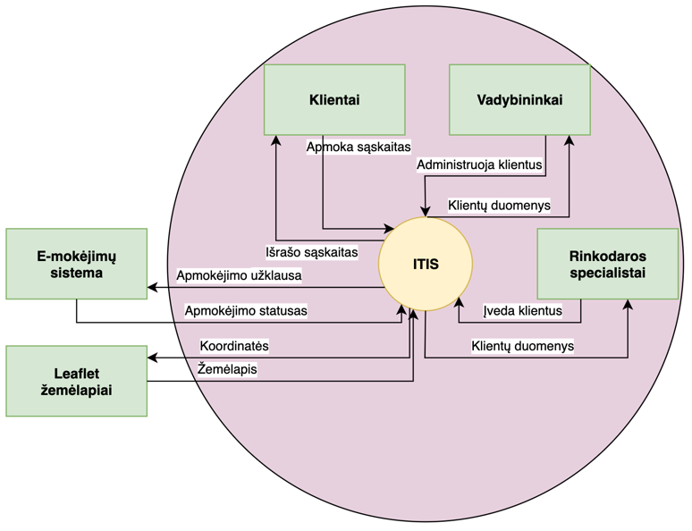
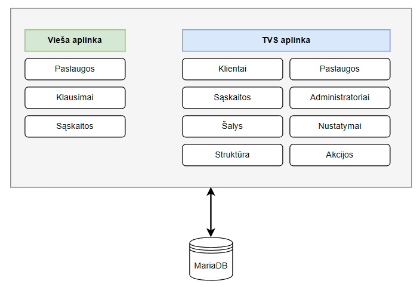

# lab 2.A
Points: 0.25
## Reikalavimai _(angl. Requirements)_
* Think of a business case and of a large enough IT system which will help solve business case
* Define stakeholders of IT system
* Create architectural description with context view of the system

# lab 2.B
Points: 1.5  
Bonus Points : Document all 7 views 0.25
## Reikalavimai _(angl. Requirements)_
* Document 5 chosen views in architectural description
* Choose views from view catalog
* Use viewpoints to document views

# lab 2.C
Points: 1  
Bonus Points: Use all 4 perspectives 0.25
## Reikalavimai _(angl. Requirements)_
* Adjust architectural description by using 2 different perspectives
* Choose perspectives from Security, Performance and scalability, Availability and resilience, Evolution perspectives

---
<h1 style="text-align:center;">Architektūrinis aprašymas <i>(angl. Architectural description)</i></h1>

# 1. Dokumento kontrolė ir įvadas _(angl. Document control (versioning))_
**Versija:** 1.0  
**Data:** 2025-11-09  
**Sistemos pavadinimas:** Interneto tiekėjo informacinė sistema (ITIS)

## 1.1. Santrauka vadovybei _(angl. Introduction to management summary (Executive summary))_
Interneto tiekėjo informacinė sistema (ITIS) skirta automatizuoti klientų duomenų, jiems priskirtų paslaugų, sąskaitų išrašymo ir apmokėjimo procesus. Ši sistema padeda interneto paslaugų tiekėjui centralizuotai valdyti klientus ir paslaugas, mažina administracinę naštą bei užtikrina duomenų saugumą.

**Pagrindiniai ITIS tikslai _(angl. Objectives of AD)_:**
- Automatizuoti sąskaitų išrašymo ir apmokėjimo procesą.
- Suteikti klientams prieigą prie jų duomenų per patogią naudotojo sąsają.
- Užtikrinti aukštą sistemos prieinamumą ir duomenų saugumą.
- Centralizuoti klientų ir paslaugų valdymą.
- Užtikrinti patogų klientų ir paslaugų valdymą administratoriams.

**Nauda:**
- Greitesnis atsiskaitymas ir mažiau rankinio darbo.
- Sumažintos klaidų rizikos.
- Geresnė klientų patirtis.
- Lengvai plečiama architektūra.
- Analitika.

## 1.2. Architektūros principai ir sprendimai _(angl. General architectural principles)_
### Bendrieji architektūriniai principai
| Nr    | Principas _(angl. Principles)_                             | Pagrindimas _(angl. Rationale)_                                                                                                                                             | Pasekmės _(angl. Implications)_                                                                       |
|:------|:-----------------------------------------------------------|:----------------------------------------------------------------------------------------------------------------------------------------------------------------------------|:------------------------------------------------------------------------------------------------------|
| **1** | **Modulinė architektūra _(angl. Separation of Concerns)_** | Sistemoje yra skirtingos paskirties funkcionalai – klientų valdymas, sąskaitos, paslaugos, klausimai – todėl juos reikia atskirti į modulius, kad būtų aiškesnė atsakomybė. | Lengvesnis testavimas ir priežiūra; modulius galima tobulinti nepriklausomai; mažesnė klaidų sklaida. |
| **2** | **Model–View–Controller (MVC) šablonas**                   | Symfony karkasas natūraliai palaiko MVC struktūrą, leidžiančią atskirti duomenis, logiką ir sąsają.                                                                         | Geresnis kodo tvarkingumas; aiškus sluoksnių padalijimas; palengvina naujų programuotojų įtraukimą.   |
| **3** | **Atvirojo kodo technologijos**                            | Naudojant Symfony, MariaDB ir EasyAdmin sumažinamos licencinės išlaidos, o bendruomenės palaikymas užtikrina stabilumą.                                                     | Mažesni kaštai; greitesnis vystymas; priklausomybė nuo bendruomenės atnaujinimų.                      |
| **4** | **Saugumo prioritetas**                                    | Sistema tvarko klientų ir mokėjimų duomenis, todėl būtina užtikrinti aukštą saugumo lygį (prisijungimas, CSRF, IP filtrai).                                                 | Papildomas kodo ir infrastruktūros sudėtingumas; reikia nuolatinio testavimo ir auditų.               |
| **5** | **Automatizavimas _(angl.Automation First)_**              | Sąskaitų generavimas, atsarginių kopijų kūrimas, testavimas – turi vykti automatiškai.                                                                                      | Mažiau žmogiškų klaidų; reikia patikimų „cron“ procesų ir log'inimo.                                  |
| **6** | **Palaikymas ir plėtra _(angl. Evolvability)_**            | Sistema turi būti pritaikoma naujoms paslaugoms ar akcijų sistemai ateityje.                                                                                                | Kodas turi būti rašomas moduliškai; reikia dokumentacijos ir testų.                                   |
| **7** | **Dviejų aplinkų principas (Test + Production)**           | Skirtingos aplinkos užtikrina, kad pakeitimai būtų testuojami prieš diegimą.                                                                                                | Reikia atskiros infrastruktūros; papildomi ištekliai, bet mažesnė klaidų rizika.                      |
| **8** | **Kokybės stebėsena ir log'inimas**                        | Visi įvykiai (prisijungimai, sąskaitų generavimas) turi būti registruojami Monolog įrankiu.                                                                                 | Sukuriamas audito pėdsakas; padidėja saugojimo poreikis.                                              |

## 1.3. Architektūrinius principus įtvirtinantys spendimai _(angl. Architectural design decision)_

| Nr.   | Sprendimas                                                          | Pagrindimas _(angl. Rationale)_                                                                              | Alternatyvos                                 | Kodėl atmestos                                                                      | Pasekmės _(angl. Implications)_                                                               |
|-------|---------------------------------------------------------------------|--------------------------------------------------------------------------------------------------------------|----------------------------------------------|-------------------------------------------------------------------------------------|-----------------------------------------------------------------------------------------------|
| **1** | **Naudoti Symfony 7 karkasą (MVC)**                                 | Symfony leidžia greitai kurti modulinius sprendimus, turi integruotą saugumą ir gerą bendruomenės palaikymą. | Laravel, Django                              | Laravel mažiau pritaikytas TVS tipo sprendimams; Django – kita kalba (Python).      | Aiškus MVC sluoksnių atskyrimas, greitesnis vystymas, geresnis testuojamumas.                 |
| **2** | **MariaDB duomenų bazė**                                            | Suderinama su PHP ir atviro kodo, greita ir patikima.                                                        | PostgreSQL, MySQL                            | PostgreSQL – per sudėtinga šiam mastui; MySQL – licencinė priklausomybė nuo Oracle. | Lengva integracija su Symfony Doctrine ORM, greitas diegimas, mažesnės išlaidos.              |
| **3** | **Front-end integruotas į tą pačią sistemą (monolitinė struktūra)** | Nedidelis projektas, todėl vieningas kodas palengvina priežiūrą.                                             | Mikroservisai                                | Mikroservisai per sudėtingi mažam projektui; reikalauja papildomos infrastruktūros. | Paprastesnė architektūra, mažesni resursai, tačiau ribotas mastelio didinimas.                |
| **4** | **Naudoti Paysera mokėjimų integraciją**                            | Paysera palaiko vietinius EUR mokėjimus, turi API, atitinka BDAR.                                            | Stripe, PayPal, Neopay                       | Stripe/PayPal mažiau lokalizuoti, didesni komisiniai.                               | Patogus lokalus apmokėjimas, mažesni mokesčiai, priklausomybė nuo trečios šalies.             |
| **5** | **Automatinis sąskaitų generavimas per „crontab“**                  | Leidžia generuoti sąskaitas be žmogaus įsikišimo.                                                            | Rankinis generavimas, atskiras mikroservisas | Rankinis – klaidų rizika; mikroservisas – per sudėtingas šiam projektui.            | Padidėja efektyvumas, tačiau reikia stebėti „cron“ procesus dėl klaidų.                       |
| **6** | **Symfony Security + CSRF apsauga**                                 | Užtikrina sesijų ir formų saugumą be papildomo kodo.                                                         | Custom autentifikacija                       | Daugiau klaidų, mažiau testuota.                                                    | Saugus prisijungimas ir sesijų valdymas, mažesnė kodo priežiūros našta.                       |
| **7** | **Naudoti EasyAdmin 3 TVS moduliui**                                | Pritaikytas Symfony, greitai kuriami CRUD valdikliai.                                                        | WordPress, custom admin panel                | WordPress per sunkus integruoti; custom – brangu kurti nuo nulio.                   | Greitas administracinės dalies kūrimas, nuosekli sąsaja, priklausomybė nuo EasyAdmin versijų. |
| **8** | **Dviejų aplinkų diegimas (testinė ir produkcinė)**                 | Užtikrina saugų kodo išbandymą prieš diegimą.                                                                | Viena aplinka                                | Didelė rizika klaidų produkcijoje.                                                  | Saugus testavimas, aiškus diegimo procesas, papildomi infrastruktūros kaštai.                 |

# 2. Suinteresuotosios šalys ir rūpesčiai _(angl. Stakeholders and concerns)_
## 2.1. Suinteresuotos šalys _(angl. Stakeholders)_

| Suinteresuota šalis _(angl. [Stakeholder](https://www.viewpoints-and-perspectives.info/home/stakeholders/))_ | Aprašymas                                                              | Interesas / poreikis                                         |
|:-------------------------------------------------------------------------------------------------------------|:-----------------------------------------------------------------------|:-------------------------------------------------------------|
| **Klientas (naudotojas)**                                                                                    | Naudojasi interneto tiekėjo paslaugomis                                | Nori matyti paslaugas, sąskaitas ir atlikti apmokėjimus      |
| **Vadybininkai**                                                                                             | Atsakingi už duomenų, paslaugų ir klientų administravimą TVS sistemoje | Nori efektyviai valdyti klientų, paslaugų duomenis           |
| **Rinkodaros specialistai**                                                                                  | Atsakingi už paslaugų siūlymą esamiems klientams, naujų įvedimą        | Nori pritraukti daugiau pinigų į įmonę                       |
| **Sistemos savininkas (tiekėjas)**                                                                           | Projekto vykdytojas                                                    | Siekia turėti patikimą, saugią ir prižiūrimą sistemą         |
| **Programuotojai**                                                                                           | Programuoja sistemą                                                    | Siekia sukurti kitoms suinteresuotoms šalims tinkamą sistemą |
| **Testuotojai**                                                                                              | Testuoja sistemą                                                       | Siekia užtikrinti sistemos veiklą be trūkių                  |
| **E-mokėjimų sistema (Paysera)**                                                                             | Trečiosios šalies integracija                                          | Teikia saugius mokėjimus klientams                           |

# 3. Viepoints
Pagal ISO/IEC 42010:2022 standartą, pasirinkti visi šie architektūriniai požiūriai _(angl. viewpoints)_, kurie padėjo sukurti ir struktūruoti ITIS architektūros vaizdus.  
Kiekvienas viewpoint apibrėžia savo aprašymą, tikslą, sprendžiamus rūpesčius, suinteresuotuosius asmenis ir naudojamus modelius.

| Požiūris _(angl. [Viewpoint](https://www.viewpoints-and-perspectives.info/home/viewpoints/))_                  | Tikslas _(angl. Purpose)_                                                                                | Sprendžiami rūpesčiai _(angl. Concerns)_                                                                                                                                                             | Suinteresuotosios šalys _(angl. Stakeholders)_                                                               | Naudojami modeliai / diagramos                                                                                                                             |
|----------------------------------------------------------------------------------------------------------------|----------------------------------------------------------------------------------------------------------|------------------------------------------------------------------------------------------------------------------------------------------------------------------------------------------------------|--------------------------------------------------------------------------------------------------------------|------------------------------------------------------------------------------------------------------------------------------------------------------------|
| **[Context Viewpoint](https://www.viewpoints-and-perspectives.info/home/viewpoints/context/)**                 | Apibrėžia sistemos ribas, jos sąveiką su išorinėmis sistemomis ir naudotojais                            | - Kaip sistema integruojama su išorinėmis paslaugomis (mokėjimais, el. paštu). - Kaip klientai ir administratoriai sąveikauja su sistema. - Kokie duomenys perduodami tarp išorinių sistemų. | Visos suinteresuotos šalys, bet labiausiai: - klientai (naudotojai) - Sistemos savininkas (tiekėjas) | - UML konteksto diagrama                                                                                                                                   |
| **[Functional Viewpoint](https://www.viewpoints-and-perspectives.info/home/viewpoints/functional-viewpoint/)** | Apibrėžia pagrindinius funkcinius modulius, jų atsakomybę ir sąveiką                                     | - Ką sistema daro (funkcijos). - Kaip šios funkcijos tarpusavyje susijusios. - Kaip skirtingi naudotojai (rolės) jas naudoja.                                                                | Visos suinteresuotos šalys                                                                                   | - UML panaudos atvejų diagramos - UML veiklos diagramos - Verslo procesų aprašai                                                                   |
| **[Information Viewpoint](https://www.viewpoints-and-perspectives.info/home/viewpoints/information/)**         | Apibrėžia pagrindines duomenų esybes ir ryšius tarp jų                                                   | - Kaip saugoma ir valdoma informacija. - Kokie yra esybių ryšiai (klientai, paslaugos, sąskaitos, akcijos). - Kaip užtikrinamas duomenų vientisumas ir saugumas.                             | - Programuotojai - Sistemos savininkas (tiekėjas)                                                        | - UML klasių diagrama - UML duomenų esybių (ERD) diagrama                                                                                              |
| **[Concurrency Viewpoint](https://www.viewpoints-and-perspectives.info/home/viewpoints/concurrency/)**         | Apibrėžia, kaip sistema elgiasi, kai keli naudotojai ar procesai veikia vienu metu                       | - Kaip tvarkomos vienalaikės užklausos į duomenų bazę. - Kaip valdomi sesijų konfliktai. - Kaip užtikrinamas stabilus veikimas esant dideliam srautui.                                       | - Programuotojai - Testuotojai                                                                                             | - Sekos diagramos (Concurrency scenarijai) - Užraktų _(angl. locks)_ ir sesijų valdymo logika                                                          |
| **[Development Viewpoint](https://www.viewpoints-and-perspectives.info/home/viewpoints/development/)**         | Apibrėžia sistemos loginę struktūrą kūrimo požiūriu – kaip organizuojamas kodas, komponentai ir moduliai | - Kaip kodas organizuotas (MVC struktūra, modulių išdėstymas). - Kaip naudojamos priklausomybės ir bibliotekos. - Kaip valdomos versijos ir testai.                                          | - Testuotojai - Sistemos savininkas (tiekėjas)                                                                | - Kodo struktūros schema - Priklausomybių _(angl. Dependency Injection)_ modelis                                                                       |
| **[Deployment Viewpoint](https://www.viewpoints-and-perspectives.info/home/viewpoints/deployment/)**           | Apibrėžia, kaip sistema diegiama į kliento infrastruktūrą                                                | - Kaip programinė įranga įdiegta (serveriai, DB, aplinkos). - Kaip užtikrinamas pasiekiamumas, atsarginės kopijos ir saugumas. - Koks ryšys tarp testinės ir produkcinės aplinkos.           | - Programuotojai - Sistemos savininkas (tiekėjas)                                                        | - Serverių topologijos schema                                                                                                                              |
| **[Operational Viewpoint](https://www.viewpoints-and-perspectives.info/home/viewpoints/operational/)**         | Apibrėžia, kaip sistema veikia, stebima ir palaikoma eksploatacijos metu                                 | - Kaip sistema prižiūrima ir stebima realiu laiku. - Kaip tvarkomi žurnalai (logai) ir klaidų ataskaitos. - Kaip atliekamos atsarginės kopijos ir atnaujinimai.                              | - Programuotojai - Testuotojai - Sistemos savininkas (tiekėjas)                                      | - Procesų priežiūros diagrama - Logų srautų modelis _(Symfony Monolog)_ - UML veiklos _(angl. activity)_ diagrama _(angl. Backup restore diagram)_ |

Šie septyni viewpoint’ai užtikrina, kad ITIS architektūra apžvelgiama iš visų esminių kampų – nuo verslo konteksto iki techninio diegimo ir eksploatacijos.  
Kiekvienas požiūris turi savo paskirtį ir suinteresuotąją auditoriją, todėl kartu jie sudaro visapusišką architektūros aprašymą pagal ISO/IEC 42010:2022 standartą.

# 4. Views
Šiame skyriuje pateikiami konkretūs ITIS architektūros vaizdai _(angl. views)_, sukurti pagal ankstesniame skyriuje aprašytus **7 Viewpoints**.  
Kiekvienas vaizdas pateikia tam tikrą sistemos architektūros aspektą, atspindintį atitinkamų suinteresuotųjų šalių rūpesčius.

## 4.1. Context View
**Aprašymas:**
Sistema susideda iš dviejų pagrindinių sričių:
- **Frontend (naudotojo sąsaja):** skirta klientams prisijungti, peržiūrėti sąskaitas, apmokėti per e-mokėjimų sistemą Paysera.
- **TVS (Turinio valdymo sistema):** skirta administratoriams, rinkodaroms specialistams valdyti klientus, paslaugas ir sąskaitas.

## 4.2. Functional View
**Aprašymas:**  
Sistema padalinta į funkcinius modulius, atspindinčius verslo procesus:
- **Klientų modulis** – kuria ir tvarko klientų įrašus.
- **Paslaugų modulis** – tvarko paslaugų sąrašą ir jų paketus.
- **Sąskaitų modulis** – generuoja ir saugo sąskaitas.
- **Klausimų modulis** – leidžia klientams pateikti klausimus.
- **Akcijų modulis** – taiko nuolaidas paslaugoms.
- **Nustatymų modulis** – apima sistemos konfigūraciją (PVM, rodymo nustatymai).
- **Struktūros modulis** – atvaizduoja tekstinius puslapius.
- **Administratorių modulis** – valdo sistemos administratorius - vadybininkus, rinkodaros specialistus.

## 4.3. Information View
**Aprašymas:**  
Duomenų modelis paremtas **Entity–Relationship (ER)** struktūra. Pagrindinės esybės:
- **Klientas** – turi kelis **Objektus**.
- **Objektas** – turi kelis **Paslaugų paketus**.
- **Paslaugos paketas** – apima vieną ar kelias **Paslaugas**.
- **Sąskaita** – generuojama pagal paslaugas, turi **Sąskaitos eilutes**.
- **Akcija** – taikoma paslaugoms ar paketams.
- **Nustatymai** – saugo sistemos konfigūraciją.

UML klasių diagrama  

UML Esybių ryšių diagrama (Baronas (Chen) notation)  

## 4.4. Concurrency  View
**Aprašymas:**  
ITIS sistema palaiko vienalaikį kelių naudotojų prisijungimą:
- Naudojamas **Symfony sesijų valdymas** – atskira sesija kiekvienam naudotojui.
- **Doctrine ORM** užtikrina duomenų vientisumą užrakinant įrašus (transactional locks).
- **crontab** procesas generuoja sąskaitas fone (asinchroninis vykdymas).
- Testuota su **Apache JMeter**, iki 1000 užklausų per 3 s.

**TODO diagram**

## 4.5. Development View
**Aprašymas:**  
Kodas organizuotas pagal **MVC (Model–View–Controller)** šabloną:
- **Model:** Doctrine ORM modeliai.
- **Controller:** Symfony kontrolerio klasės, valdantys logiką.
- **View:** Twig šablonai.

Papildomai:
- Naudojamas **EasyAdmin 3** TVS daliai.
- PHP bibliotekų priklausomybės valdomos per **Composer**.
- Kodo kokybė tikrinama per **PHPUnit** testus.

**Rezultatas:**  
Development View užtikrina, kad programinė architektūra būtų tvarkinga, modulinė ir lengvai plečiama.

**TODO diagram**

## 4.6. Deployment View
**Aprašymas:**
Sistemos komponentai diegiami į dvi aplinkas:
- **Testinę** (staging) – naujų funkcijų bandymams.
- **Produkcijos** (production) – veikianti versija vartotojams.

**Serverių konfigūracija:**
- OS: Ubuntu 24 LTS
- Web serveris: Apache
- DBVS: MariaDB 11
- PHP 8.2, JavaScript
- Automatizuoti darbai: crontab (sąskaitų generavimas)
- Log'inimas: Symfony Monolog

**TODO diagram**

## 4.7. Operational View
**Aprašymas:**
- **Monolog** fiksuoja veiksmus ir klaidas („.log“ failai saugomi 90 dienų).
- **Automatinės atsarginės kopijos** vykdomos periodiškai.
- **Serverio stebėsena** atliekama per OS įrankius (pvz., `top`, `journalctl`).
- **Klaidos** siunčiamos administratoriui el. paštu, Sentry įrankiu.
- **Atnaujinimai** vykdomi per „composer update“ ir cache valymą.

**Rezultatas:**  
Operational View parodo, kaip sistema veikia realiame gyvenimo cikle — kaip ji stebima, palaikoma ir atstatoma gedimo atveju.

**TODO diagram**

## 4.8. Santrauka
Šie vaizdai bendrai aprašo **ITIS architektūrą iš kelių perspektyvų**, kad kiekviena suinteresuotųjų šalis galėtų suprasti jai svarbius aspektus:
- klientai – kontekstą ir funkcijas;
- vadybininkai – terpę valdyti klientus;
- rinkodaros specialistai – terpę valdyti klientus;
- programuotojai – loginę ir duomenų struktūrą;
- testuotojai – duomenų patikimumą;
- sistemos savininkas (tiekėjas) – diegimą, saugumą ir našumą.

Kartu jie sudaro išsamų, subalansuotą architektūros aprašymą, atitinkantį ISO/IEC 42010 reikalavimus.

# 5. Perspektyvos _(angl. [Perspectives](https://www.viewpoints-and-perspectives.info/home/perspectives/))_
## 5.1. Prieinamumas neįgaliems _(angl. [Accessibility](https://www.viewpoints-and-perspectives.info/home/perspectives/accessibility/))_
Nereikia.

## 5.2. Prieinamumas ir Atsparumas _(angl. [Availability and Resilience](https://www.viewpoints-and-perspectives.info/home/perspectives/availability-and-resilience/))_

| Aspektas                                     | Taikymas                                                                                                                                                                                                                 |
|----------------------------------------------|--------------------------------------------------------------------------------------------------------------------------------------------------------------------------------------------------------------------------|
| **Taikymas _(angl. Applicability)_**         |                                                                                                                                                                                                                          |
| **Sprendžiami rūpesčiai _(angl. Concerns)_** | - Laikas iki atstatymo (time to repair) po gedimo. - Nelaimės atstatymo (disaster recovery) strategijos. - Vienos klaidos taško (single point of failure) identifikavimas.                                                                                                      |
| **Veiksmai _(angl. Activities)_**            |                                                                                                                                                                                                                          |
| **Taktikos _(angl. Tactics)_**               | - Sistemos „kūrimo gedimams“ _(angl. „design for failure“)_ principas — manyti, kad komponentas gali sugesti, ir numatyti mechanizmus atstatymui. - Automatizuotos atsarginių kopijų procesai, atstatymo procedūros. |
| **Spąstai _(angl. Pitfalls)_**               |                                                                                                                                                                                                                          |

## 5.3. Plėtros ištekliai _(angl. [Development Resource](https://www.viewpoints-and-perspectives.info/home/perspectives/development-resource-perspective/))_
Nereikia.

## 5.4. Evoliucija _(angl. [Evolution](https://www.viewpoints-and-perspectives.info/home/perspectives/evolution/))_

| Aspektas                                     | Taikymas                                                                                                                                                                                                                                                                                                                                                                                                                                                                                          |
|----------------------------------------------|---------------------------------------------------------------------------------------------------------------------------------------------------------------------------------------------------------------------------------------------------------------------------------------------------------------------------------------------------------------------------------------------------------------------------------------------------------------------------------------------------|
| **Taikymas _(angl. Applicability)_**         | Ši perspektyva taikoma tam, kad ITIS sistema galėtų ilgainiui būti tobulinama ir pritaikoma naujiems verslo bei technologiniams poreikiams. Ji užtikrina, kad architektūra būtų pakankamai lanksti diegiant naujas paslaugas (pvz., papildomi mokėjimų tiekėjai, akcijų moduliai ar mobilioji sąsaja).                                                                                                                                                                                            |
| **Sprendžiami rūpesčiai _(angl. Concerns)_** | - Kaip sistema gali būti plečiama naujais moduliais ir funkcijomis be didelių perrašymų. - Kaip užtikrinti, kad atnaujinimai (framework, DB) būtų suderinami su esamais komponentais. - Kaip išlaikyti duomenų suderinamumą keičiant modelius ar struktūras. - Kaip planuoti versijų atnaujinimus (Symfony, PHP).                                                                                                                                                                        |
| **Veiksmai _(angl. Activities)_**            | - Modulinės architektūros palaikymas (kiekvienas modulis gali būti vystomas nepriklausomai). - Reguliarus priklausomybių atnaujinimas per Composer. - Migracijų valdymas naudojant Doctrine Migration įrankį. - Kodo refaktoringas pagal testų rezultatus. - Naudotojų poreikių analizė naujų funkcijų planavimui. - Dokumentacijos palaikymas ir atnaujinimas.                                                                                                                    |
| **Taktikos _(angl. Tactics)_**               | - Naudoti **MVC** ir **Service-oriented** architektūros principus, kad modulius būtų galima keisti nepriklausomai. - Naudoti **versijų valdymo sistemą (Git)** su aiškiu „branching“ modeliu (pvz., *GitFlow*). - Naudoti **automatinį testavimą (PHPUnit)** prieš kiekvieną atnaujinimą. - Naudoti **Continuous Integration (CI)** ir **Continuous Deployment (CD)** procesus. - Numatyti **API sąsajas** išoriniams moduliniams plėtiniams (pvz., papildomiems mokėjimų tiekėjams). |
| **Spąstai _(angl. Pitfalls)_**               | - Architektūra tampa pernelyg monolitinė, todėl kiekvienas pakeitimas paveikia visą sistemą. - Nepakankamas testų rinkinys – didelė rizika sugadinti esamas funkcijas. - Priklausomybės nuo konkrečios Symfony ar PHP versijos gali apsunkinti atnaujinimus. - Nepakankamas dokumentacijos atnaujinimas lemia žinių praradimą. - Nenumatyta duomenų migracijos strategija sukelia klaidas atnaujinimų metu.                                                                           |

## 5.5. Internacionalizacija _(angl. [Internationalization](https://www.viewpoints-and-perspectives.info/home/perspectives/internationalization/))_
Nereikia.

## 5.6. Vieta _(angl. [Location](https://www.viewpoints-and-perspectives.info/home/perspectives/location/))_
Nereikia.

## 5.7. Našumas ir mastelio keitimas _(angl. [Performance and Scalability](https://www.viewpoints-and-perspectives.info/home/perspectives/performance-and-scalability/))_

| Aspektas                                     | Taikymas |
|----------------------------------------------|----------|
| **Taikymas _(angl. Applicability)_**         |          |
| **Sprendžiami rūpesčiai _(angl. Concerns)_** |          |
| **Veiksmai _(angl. Activities)_**            |          |
| **Taktikos _(angl. Tactics)_**               |          |
| **Spąstai _(angl. Pitfalls)_**               |          |

## 5.8. Teisinis reguliavimas _(angl. [Regulation](https://www.viewpoints-and-perspectives.info/home/perspectives/regulation-perspective/))_
Nereikia.

## 5.9. Saugumas _(angl. [Security](https://www.viewpoints-and-perspectives.info/home/perspectives/security/))_

| Aspektas                                     | Taikymas                                                                                                                                                                                                                                                                                                                                                                                                                                                                                                                                                                                                                                                             |
|----------------------------------------------|----------------------------------------------------------------------------------------------------------------------------------------------------------------------------------------------------------------------------------------------------------------------------------------------------------------------------------------------------------------------------------------------------------------------------------------------------------------------------------------------------------------------------------------------------------------------------------------------------------------------------------------------------------------------|
| **Taikymas _(angl. Applicability)_**         | Ši perspektyva taikoma visiems ITIS sistemos komponentams, siekiant apsaugoti klientų duomenis, mokėjimų informaciją ir užtikrinti, kad tik įgalioti naudotojai galėtų pasiekti savo duomenis. Saugumas yra kertinis sistemos aspektas, nes ji tvarko asmeninius ir finansinius duomenis.                                                                                                                                                                                                                                                                                                                                                                            |
| **Sprendžiami rūpesčiai _(angl. Concerns)_** | - Kaip autentifikuojami naudotojai (klientai ir administratoriai). - Kaip užtikrinamas duomenų vientisumas ir konfidencialumas. - Kaip valdomos prieigos teisės (rolės ir leidimai). - Kaip apsisaugoma nuo įsilaužimų, CSRF, XSS, SQL Injection atakų. - Kaip saugomos ir perduodamos jautrios reikšmės (pvz., slaptažodžiai). - Kaip fiksuojami ir stebimi saugumo incidentai.                                                                                                                                                                                                                                                                      |
| **Veiksmai _(angl. Activities)_**            | - Įdiegti **Symfony Security** modulį autentifikacijai ir rolėms valdyti. - Naudoti **CSRF token'us** formoms ir POST užklausoms. - Naudoti **HTTPS (SSL)** visam duomenų srautui tarp naudotojo ir serverio. - Slaptažodžių saugojimui naudoti saugius **bcrypt / Argon2** algoritmus. - Diegti **log'inimą su Monolog**, fiksuojant prisijungimus, nesėkmingus bandymus. - Diegti klaidų gaudymo įrankį **Sentry**, kuris iškart informuoja administratorius. - Reguliariai testuoti sistemą naudojant **OWASP ZAP / Burp Suite**. - Pasitelkti išorinius testuotojus. - Stebėti serverių saugumą, OS atnaujinimus, PHP klaidų taisymus. |
| **Taktikos _(angl. Tactics)_**               | - Įgyvendinti **mažiausių privilegijų principą (Least Privilege Principle)** – kiekvienas naudotojas turi tik jam būtinas teises. - **Defence in Depth** – keli apsaugos sluoksniai (serveris, DB, aplikacija, tinklas). - **Input validation** – duomenų įvesties validacija prieš apdorojant. - **Error handling & logging** – saugūs klaidų pranešimai be jautrios informacijos. - **Session management** – ribotas sesijų galiojimo laikas ir automatinis atsijungimas. - **Security by default** – išjungtos nereikalingos paslaugos, aiškūs konfigūracijos failai.                                                                              |
| **Spąstai _(angl. Pitfalls)_**               | - Prasta rolių valdymo sistema leidžia neautorizuotą prieigą prie administracinės dalies. - Neužšifruotas srautas (HTTP vietoje HTTPS) gali leisti duomenų perėmimą. - Netinkamai valdomos sesijos (neuždarius prisijungimų). - Perteklinė klaidų informacija gali atskleisti sistemos struktūrą. - Nepakankamas log'ų stebėjimas lemia saugumo incidentų praleidimą. - Trūksta periodinių saugumo auditų ir testavimo procesų.                                                                                                                                                                                                                       |

## 5.10. Naudojimo patogumas _(angl. [Usability](https://www.viewpoints-and-perspectives.info/home/perspectives/usability-perspective/))_
Nereikia.

# Appendix A. Architecture decisions and rationale
TODO
