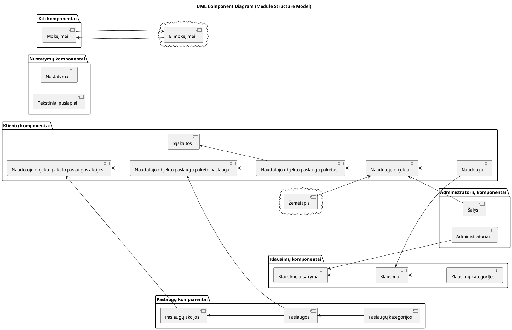
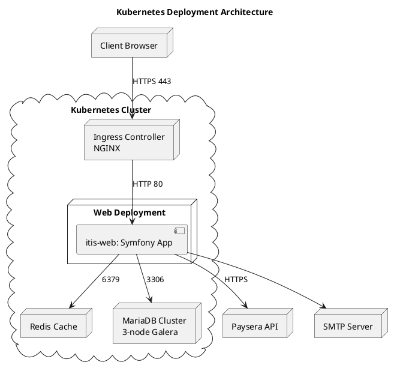

# lab 2.A
**Reikalavimai _(angl. Requirements)_**
* Think of a business case and of a large enough IT system which will help solve business case
* Define stakeholders of IT system
* Create architectural description with context view of the system

Points: 0.25

#### Į ką atkreipia dėmesį
- Funkciniai, nefunkciniai reikalavimai
- Suinteresuotos šalys
- Sistemos apimtis (Scope)
- Context view diagrama
- Context view scenarijai
- Neturi būti konkrečios technologijos - reikia rašyti iš verslo pusės

# lab 2.B
**Reikalavimai _(angl. Requirements)_**
* Document 5 chosen views in architectural description
* Choose views from view catalog
* Use viewpoints to document views

Points: 1.5  
Bonus Points : Document all 7 views 0.25

# lab 2.C
**Reikalavimai _(angl. Requirements)_**
* Adjust architectural description by using 2 different perspectives
* Choose perspectives from Security, Performance and scalability, Availability and resilience, Evolution perspectives

Points: 1  
Bonus Points: Use all 4 perspectives 0.25

---
<h1 style="text-align:center;">Architektūrinis aprašymas <i>(angl. Architectural description)</i></h1>


# 1. Dokumento kontrolė ir įvadas _(angl. Document control (versioning))_
**Versija:** 1.0  
**Data:** 2025-11-09  
**Sistemos pavadinimas:** Interneto tiekėjo informacinė sistema (ITIS)

## 1.1. Santrauka vadovybei _(angl. Introduction to management summary (Executive summary))_
Interneto tiekėjo informacinė sistema (ITIS) skirta automatizuoti klientų duomenų, jiems priskirtų paslaugų, sąskaitų išrašymo ir apmokėjimo procesus. Ši sistema padeda interneto paslaugų tiekėjui centralizuotai valdyti klientus ir paslaugas, mažina administracinę naštą bei užtikrina duomenų saugumą.

**Pagrindiniai ITIS tikslai _(angl. Objectives of AD)_:**
- Automatizuoti sąskaitų išrašymo ir apmokėjimo procesą.
- Suteikti klientams prieigą prie jų duomenų per patogią naudotojo sąsają.
- Užtikrinti aukštą sistemos prieinamumą ir duomenų saugumą.
- Centralizuoti klientų ir paslaugų valdymą.
- Užtikrinti patogų klientų ir paslaugų valdymą administratoriams.

**Nauda:**
- Greitesnis atsiskaitymas ir mažiau rankinio darbo.
- Sumažintos klaidų rizikos.
- Geresnė klientų patirtis.
- Lengvai plečiama architektūra.
- Analitika.

**Sistemos tikslas _(angl. Purpose)_:**
- Sistema gali:
  - Klientų savitarna:
    - Gali peržiūrėti savo paslaugas, sąskaitas, mokėjimus, objektus
    - Užduoti klausimą administracijai (per klausimų modulį)
  - Vadibininkų funkcijos:
    - Gali kurti klientus
    - Gali koreguoti visus klientų, paslaugų duomenis, akcijas
  - Informaciniai ir veikimo mechanizmai:
    - Log'inti visas klaidas ir sistemos veiksmus
    - Kaupti veiklos žurnalus 90 dienų
    - Veikti dvejose aplinkose — testavimo (staging) ir production'o.
- Sistema neturi, negali:
  - Klientų ir paslaugų valdymas:
    - Klientas pats negali užsiregistruoti į sistemą - jį gali priregistruoti tik vadybininkas
    - Klientas pats negali užsakyti paslaugų - tik per vadybininką
    - Klientas pats negali keisti sutarties
  - Finansai ir apmokėjimai:
    - Sistema nepriima mokėjimų tiesiogiai – visi apmokėjimai vykdomi tik per integruotą e-mokėjimų sistemą (Paysera API)
    - Sistema neapdoroja grąžinimų (refunds) automatiškai – tai daro finansų skyrius
    - Sistema nesaugo pilnų mokėjimo kortelių duomenų (tik tokenizuotus ID iš e-mokėjimo sistemos, jei reikia)
  - Finansai
    - Sistema neprognozuoja pajamų ar paslaugų vartojimo tendencijų – analitika ribota iki bendros ataskaitų peržiūra.

## 1.2. Architektūros principai ir sprendimai _(angl. General architectural principles)_
### Bendrieji architektūriniai principai
| Nr    | Principas _(angl. Principles)_                             | Pagrindimas _(angl. Rationale)_                                                                                                                                             | Pasekmės _(angl. Implications)_                                                                       |
|:------|:-----------------------------------------------------------|:----------------------------------------------------------------------------------------------------------------------------------------------------------------------------|:------------------------------------------------------------------------------------------------------|
| **1** | **Modulinė architektūra _(angl. Separation of Concerns)_** | Sistemoje yra skirtingos paskirties funkcionalai – klientų valdymas, sąskaitos, paslaugos, klausimai – todėl juos reikia atskirti į modulius, kad būtų aiškesnė atsakomybė. | Lengvesnis testavimas ir priežiūra; modulius galima tobulinti nepriklausomai; mažesnė klaidų sklaida. |
| **2** | **Model–View–Controller (MVC) šablonas**                   | Symfony karkasas natūraliai palaiko MVC struktūrą, leidžiančią atskirti duomenis, logiką ir sąsają.                                                                         | Geresnis kodo tvarkingumas; aiškus sluoksnių padalijimas; palengvina naujų programuotojų įtraukimą.   |
| **3** | **Atvirojo kodo technologijos**                            | Naudojant Symfony, MariaDB ir EasyAdmin sumažinamos licencinės išlaidos, o bendruomenės palaikymas užtikrina stabilumą.                                                     | Mažesni kaštai; greitesnis vystymas; priklausomybė nuo bendruomenės atnaujinimų.                      |
| **4** | **Saugumo prioritetas**                                    | Sistema tvarko klientų ir mokėjimų duomenis, todėl būtina užtikrinti aukštą saugumo lygį (prisijungimas, CSRF, IP filtrai).                                                 | Papildomas kodo ir infrastruktūros sudėtingumas; reikia nuolatinio testavimo ir auditų.               |
| **5** | **Automatizavimas _(angl.Automation First)_**              | Sąskaitų generavimas, atsarginių kopijų kūrimas, testavimas – turi vykti automatiškai.                                                                                      | Mažiau žmogiškų klaidų; reikia patikimų „cron“ procesų ir log'inimo.                                  |
| **6** | **Palaikymas ir plėtra _(angl. Evolvability)_**            | Sistema turi būti pritaikoma naujoms paslaugoms ar akcijų sistemai ateityje.                                                                                                | Kodas turi būti rašomas moduliškai; reikia dokumentacijos ir testų.                                   |
| **7** | **Dviejų aplinkų principas (Test + Production)**           | Skirtingos aplinkos užtikrina, kad pakeitimai būtų testuojami prieš diegimą.                                                                                                | Reikia atskiros infrastruktūros; papildomi ištekliai, bet mažesnė klaidų rizika.                      |
| **8** | **Kokybės stebėsena ir log'inimas**                        | Visi įvykiai (prisijungimai, sąskaitų generavimas) turi būti registruojami Monolog įrankiu.                                                                                 | Sukuriamas audito pėdsakas; padidėja saugojimo poreikis.                                              |

## 1.3. Architektūrinius principus įtvirtinantys spendimai _(angl. Architectural design decision)_

| Nr.   | Sprendimas                                                          | Pagrindimas _(angl. Rationale)_                                                                              | Alternatyvos                                 | Kodėl atmestos                                                                      | Pasekmės _(angl. Implications)_                                                               |
|-------|---------------------------------------------------------------------|--------------------------------------------------------------------------------------------------------------|----------------------------------------------|-------------------------------------------------------------------------------------|-----------------------------------------------------------------------------------------------|
| **1** | **Naudoti Symfony 7 karkasą (MVC)**                                 | Symfony leidžia greitai kurti modulinius sprendimus, turi integruotą saugumą ir gerą bendruomenės palaikymą. | Laravel, Django                              | Laravel mažiau pritaikytas TVS tipo sprendimams; Django – kita kalba (Python).      | Aiškus MVC sluoksnių atskyrimas, greitesnis vystymas, geresnis testuojamumas.                 |
| **2** | **MariaDB duomenų bazė**                                            | Suderinama su PHP ir atviro kodo, greita ir patikima.                                                        | PostgreSQL, MySQL                            | PostgreSQL – per sudėtinga šiam mastui; MySQL – licencinė priklausomybė nuo Oracle. | Lengva integracija su Symfony Doctrine ORM, greitas diegimas, mažesnės išlaidos.              |
| **3** | **Front-end integruotas į tą pačią sistemą (monolitinė struktūra)** | Nedidelis projektas, todėl vieningas kodas palengvina priežiūrą.                                             | Mikroservisai                                | Mikroservisai per sudėtingi mažam projektui; reikalauja papildomos infrastruktūros. | Paprastesnė architektūra, mažesni resursai, tačiau ribotas mastelio didinimas.                |
| **4** | **Naudoti Paysera mokėjimų integraciją**                            | Paysera palaiko vietinius EUR mokėjimus, turi API, atitinka BDAR.                                            | Stripe, PayPal, Neopay                       | Stripe/PayPal mažiau lokalizuoti, didesni komisiniai.                               | Patogus lokalus apmokėjimas, mažesni mokesčiai, priklausomybė nuo trečios šalies.             |
| **5** | **Automatinis sąskaitų generavimas per „crontab“**                  | Leidžia generuoti sąskaitas be žmogaus įsikišimo.                                                            | Rankinis generavimas, atskiras mikroservisas | Rankinis – klaidų rizika; mikroservisas – per sudėtingas šiam projektui.            | Padidėja efektyvumas, tačiau reikia stebėti „cron“ procesus dėl klaidų.                       |
| **6** | **Symfony Security + CSRF apsauga**                                 | Užtikrina sesijų ir formų saugumą be papildomo kodo.                                                         | Custom autentifikacija                       | Daugiau klaidų, mažiau testuota.                                                    | Saugus prisijungimas ir sesijų valdymas, mažesnė kodo priežiūros našta.                       |
| **7** | **Naudoti EasyAdmin 3 TVS moduliui**                                | Pritaikytas Symfony, greitai kuriami CRUD valdikliai.                                                        | WordPress, custom admin panel                | WordPress per sunkus integruoti; custom – brangu kurti nuo nulio.                   | Greitas administracinės dalies kūrimas, nuosekli sąsaja, priklausomybė nuo EasyAdmin versijų. |
| **8** | **Dviejų aplinkų diegimas (testinė ir produkcinė)**                 | Užtikrina saugų kodo išbandymą prieš diegimą.                                                                | Viena aplinka                                | Didelė rizika klaidų produkcijoje.                                                  | Saugus testavimas, aiškus diegimo procesas, papildomi infrastruktūros kaštai.                 |

## 1.4. Sistemos reikalavimai _(angl. System requirements)_
### 1.4.1. Funkciniai reikalavimai _(angl. Functional requirements)_

| Nr.     | Reikalavimas                           | Aprašymas                                                                                                                |
|---------|----------------------------------------|--------------------------------------------------------------------------------------------------------------------------|
| **F1**  | **Kliento prisijungimas**              | Sistema turi leisti klientui prisijungti prie savitarnos naudodama el. paštą ir slaptažodį.                              |
| **F2**  | **Kliento duomenų peržiūra**           | Klientas turi galėti peržiūrėti savo sutartis, paslaugas, sąskaitas ir mokėjimų istoriją.                                |
| **F3**  | **Sąskaitų generavimas**               | Sistema turi automatiškai generuoti sąskaitas klientams pagal aktyvias paslaugas (naudojant „crontab“).                  |
| **F4**  | **Mokėjimų integracija su Paysera**    | Sistema turi palaikyti e-mokėjimus per Paysera API, registruoti apmokėjimo būseną ir pranešti apie nesėkmingus bandymus. |
| **F5**  | **Vadybininko prisijungimas prie TVS** | Vadybininkas turi galėti prisijungti prie TVS administracinės dalies per EasyAdmin valdymo panelę.                       |
| **F6**  | **Klientų administravimas**            | Vadybininkas gali kurti, redaguoti ir ištrinti klientų įrašus.                                                           |
| **F7**  | **Paslaugų administravimas**           | Vadybininkas gali kurti, redaguoti ir ištrinti paslaugas bei jų paketus.                                                 |
| **F8**  | **Akcijų ir nuolaidų valdymas**        | Rinkodaros specialistas gali pridėti akcijas, kurios taikomos konkrečioms paslaugoms.                                    |
| **F9**  | **Pranešimų siuntimas**                | Sistema turi siųsti el. laiškus klientams apie sąskaitas, mokėjimus ar sistemos pakeitimus.                              |
| **F10** | **Logų ir įvykių registravimas**       | Sistema turi fiksuoti visus svarbius įvykius (prisijungimai, sąskaitų generavimas, klaidos) Monolog įrankiu.             |
| **F11** | **Atsarginės kopijos**                 | Sistema turi generuoti duomenų bazės atsargines kopijas nustatytu periodiškumu.                                          |
| **F12** | **Rolės ir leidimai**                  | Sistema turi palaikyti skirtingas roles (klientas, vadybininkas, rinkodaros specialistas, administratorius).             |
| **F13** | **Veiklos ataskaitos**                 | Sistema turi pateikti bendrą klientų, paslaugų ir apyvartos statistiką vadybininkui ar savininkui.                       |

### 1.4.2. Nefunkciniai reikalavimai _(angl. Non-functional requirements)_

| Nr.      | Reikalavimas                            | Aprašymas                                                                                                                             |
|----------|-----------------------------------------|---------------------------------------------------------------------------------------------------------------------------------------|
| **NF1**  | **Našumas (Performance)**               | Sistema turi apdoroti bent 10000 užklausų per 1 sekundę esant apkrovai.                                                               |
| **NF2**  | **Prieinamumas (Availability)**         | Sistema turi būti pasiekiama bent 99,99 % laiko per mėnesį.                                                                           |
| **NF3**  | **Atsparumas (Resilience)**             | Gedimo atveju sistema turi būti atstatoma ne vėliau kaip per 2 valandas (MTTR ≤ 2 h).                                                 |
| **NF4**  | **Saugumas (Security)**                 | Visi duomenys perduodami HTTPS protokolu; slaptažodžiai saugomi su bcrypt / Argon2; naudojami CSRF token'ai.                          |
| **NF5**  | **Duomenų apsauga (Privacy)**           | Sistema turi atitikti BDAR _(angl. GDPR)_ reikalavimus — klientas turi teisę peržiūrėti, ištaisyti ir prašyti ištrinti savo duomenis. |
| **NF6**  | **Pritaikomumas (Usability)**           | Kliento savitarna turi būti aiški ir pasiekiama per 3 paspaudimus iki pagrindinės informacijos (sąskaitos ar paslaugos).              |
| **NF7**  | **Patikimumas (Reliability)**           | Sistema turi išlaikyti stabilų veikimą be klaidų esant keliems šimtams aktyvių vartotojų.                                             |
| **NF8**  | **Palaikymas (Maintainability)**        | Architektūra turi būti modulinė (MVC), kad kiekvienas modulis galėtų būti atnaujinamas nepriklausomai.                                |
| **NF9**  | **Išplečiamumas (Scalability)**         | Sistema turi būti parengta pridėti papildomus modulinius komponentus (pvz., naujus mokėjimo tiekėjus).                                |
| **NF10** | **Perkeliamumas (Portability)**         | Sistema turi būti paleidžiama tiek Linux, tiek Windows serveriuose be kodo keitimo.                                                   |
| **NF11** | **Testuojamumas (Testability)**         | Visi verslo moduliai turi būti padengti bent 70 % vienetinių testų (unit tests).                                                      |
| **NF12** | **Naudojamumo stebėjimas (Monitoring)** | Sistema turi fiksuoti klaidas, įvykius ir siųsti pranešimus el. paštu (Monolog + Sentry).                                             |

# 2. Suinteresuotosios šalys ir rūpesčiai _(angl. Stakeholders and concerns)_
## 2.1. Suinteresuotos šalys _(angl. Stakeholders)_

| Suinteresuota šalis _(angl. [Stakeholder](https://www.viewpoints-and-perspectives.info/home/stakeholders/))_  | Aprašymas                                                              | Interesas / poreikis                                            |
|:--------------------------------------------------------------------------------------------------------------|:-----------------------------------------------------------------------|:----------------------------------------------------------------|
| **Klientas (naudotojas)**                                                                                     | Naudojasi interneto tiekėjo paslaugomis                                | Nori matyti paslaugas, sąskaitas ir atlikti apmokėjimus         |
| **Vadybininkai**                                                                                              | Atsakingi už duomenų, paslaugų ir klientų administravimą TVS sistemoje | Nori efektyviai valdyti klientų, paslaugų duomenis              |
| **Rinkodaros specialistai**                                                                                   | Atsakingi už paslaugų siūlymą esamiems klientams, naujų įvedimą        | Nori pritraukti daugiau pinigų į įmonę                          |
| **Sistemos savininkas (tiekėjas)**                                                                            | Projekto vykdytojas                                                    | Siekia turėti patikimą, saugią ir prižiūrimą sistemą            |
| **Programuotojai**                                                                                            | Programuoja sistemą                                                    | Siekia sukurti kitoms suinteresuotoms šalims tinkamą sistemą    |
| **Testuotojai**                                                                                               | Testuoja sistemą                                                       | Siekia užtikrinti sistemos veiklą be trūkių                     |
| **E-mokėjimų sistema (Paysera)**                                                                              | Trečiosios šalies integracija                                          | Teikia saugius mokėjimus klientams                              |
| **Žemėlapio integracija (Leaflet)**                                                                           | Trečiosios šalies integracija                                          | Teikia žemėlapį vadybininkams ir rinkodaros specialistams TVS'e |

# 3. Viepoints
Pagal ISO/IEC 42010:2022 standartą, pasirinkti visi šie architektūriniai požiūriai _(angl. viewpoints)_, kurie padėjo sukurti ir struktūruoti ITIS architektūros vaizdus.  
Kiekvienas viewpoint apibrėžia savo aprašymą, tikslą, sprendžiamus rūpesčius, suinteresuotuosius asmenis ir naudojamus modelius.

| Požiūris _(angl. [Viewpoint](https://www.viewpoints-and-perspectives.info/home/viewpoints/))_                  | Tikslas _(angl. Purpose)_                                                                                | Sprendžiami rūpesčiai _(angl. Concerns)_                                                                                                                                                             | Suinteresuotosios šalys _(angl. Stakeholders)_                                                               | Naudojami modeliai / diagramos                                                                                                                             |
|----------------------------------------------------------------------------------------------------------------|----------------------------------------------------------------------------------------------------------|------------------------------------------------------------------------------------------------------------------------------------------------------------------------------------------------------|--------------------------------------------------------------------------------------------------------------|------------------------------------------------------------------------------------------------------------------------------------------------------------|
| **[Context Viewpoint](https://www.viewpoints-and-perspectives.info/home/viewpoints/context/)**                 | Apibrėžia sistemos ribas, jos sąveiką su išorinėmis sistemomis ir naudotojais                            | - Kaip sistema integruojama su išorinėmis paslaugomis (mokėjimais, el. paštu).<br/>- Kaip klientai ir administratoriai sąveikauja su sistema.<br/>- Kokie duomenys perduodami tarp išorinių sistemų. | Visos suinteresuotos šalys, bet labiausiai:<br/>- klientai (naudotojai)<br/>- Sistemos savininkas (tiekėjas) | - UML konteksto diagrama                                                                                                                                   |
| **[Functional Viewpoint](https://www.viewpoints-and-perspectives.info/home/viewpoints/functional-viewpoint/)** | Apibrėžia pagrindinius funkcinius modulius, jų atsakomybę ir sąveiką                                     | - Ką sistema daro (funkcijos).<br/>- Kaip šios funkcijos tarpusavyje susijusios.<br/>- Kaip skirtingi naudotojai (rolės) jas naudoja.                                                                | Visos suinteresuotos šalys                                                                                   | - UML panaudos atvejų diagramos<br/>- UML veiklos diagramos<br/>- Verslo procesų aprašai                                                                   |
| **[Information Viewpoint](https://www.viewpoints-and-perspectives.info/home/viewpoints/information/)**         | Apibrėžia pagrindines duomenų esybes ir ryšius tarp jų                                                   | - Kaip saugoma ir valdoma informacija.<br/>- Kokie yra esybių ryšiai (klientai, paslaugos, sąskaitos, akcijos).<br/>- Kaip užtikrinamas duomenų vientisumas ir saugumas.                             | - Programuotojai<br/>- Sistemos savininkas (tiekėjas)                                                        | - UML klasių _(angl. class)_ diagrama<br/>- UML esybių ryšių (ER) diagrama<br/>- UML esybių ryšių (ER) žvaigždinė _(angl. star)_ diagrama                  |
| **[Concurrency Viewpoint](https://www.viewpoints-and-perspectives.info/home/viewpoints/concurrency/)**         | Apibrėžia, kaip sistema elgiasi, kai keli naudotojai ar procesai veikia vienu metu                       | - Kaip tvarkomos vienalaikės užklausos į duomenų bazę.<br/>- Kaip valdomi sesijų konfliktai.<br/>- Kaip užtikrinamas stabilus veikimas esant dideliam srautui.                                       | - Programuotojai<br/>- Testuotojai                                                                                             | - Sekos diagramos (Concurrency scenarijai)<br/>- Užraktų _(angl. locks)_ ir sesijų valdymo logika                                                          |
| **[Development Viewpoint](https://www.viewpoints-and-perspectives.info/home/viewpoints/development/)**         | Apibrėžia sistemos loginę struktūrą kūrimo požiūriu – kaip organizuojamas kodas, komponentai ir moduliai | - Kaip kodas organizuotas (MVC struktūra, modulių išdėstymas).<br/>- Kaip naudojamos priklausomybės ir bibliotekos.<br/>- Kaip valdomos versijos ir testai.                                          | - Testuotojai<br/>- Sistemos savininkas (tiekėjas)                                                                | - Kodo struktūros schema<br/>- Priklausomybių _(angl. Dependency Injection)_ modelis                                                                       |
| **[Deployment Viewpoint](https://www.viewpoints-and-perspectives.info/home/viewpoints/deployment/)**           | Apibrėžia, kaip sistema diegiama į kliento infrastruktūrą                                                | - Kaip programinė įranga įdiegta (serveriai, DB, aplinkos).<br/>- Kaip užtikrinamas pasiekiamumas, atsarginės kopijos ir saugumas.<br/>- Koks ryšys tarp testinės ir produkcinės aplinkos.           | - Programuotojai<br/>- Sistemos savininkas (tiekėjas)                                                        | - Serverių topologijos schema                                                                                                                              |
| **[Operational Viewpoint](https://www.viewpoints-and-perspectives.info/home/viewpoints/operational/)**         | Apibrėžia, kaip sistema veikia, stebima ir palaikoma eksploatacijos metu                                 | - Kaip sistema prižiūrima ir stebima realiu laiku.<br/>- Kaip tvarkomi žurnalai (logai) ir klaidų ataskaitos.<br/>- Kaip atliekamos atsarginės kopijos ir atnaujinimai.                              | - Programuotojai<br/>- Testuotojai<br/>- Sistemos savininkas (tiekėjas)                                      | - Procesų priežiūros diagrama<br/>- Logų srautų modelis _(Symfony Monolog)_<br/>- UML veiklos _(angl. activity)_ diagrama _(angl. Backup restore diagram)_ |

Šie septyni viewpoint’ai užtikrina, kad ITIS architektūra apžvelgiama iš visų esminių kampų – nuo verslo konteksto iki techninio diegimo ir eksploatacijos.  
Kiekvienas požiūris turi savo paskirtį ir suinteresuotąją auditoriją, todėl kartu jie sudaro visapusišką architektūros aprašymą pagal ISO/IEC 42010:2022 standartą.

# 4. Architektūros vaizdai _(angl. Views)_
Šiame skyriuje pateikiami konkretūs ITIS architektūros vaizdai _(angl. views)_, sukurti pagal ankstesniame skyriuje aprašytus **7 Viewpoints**.  
Kiekvienas vaizdas pateikia tam tikrą sistemos architektūros aspektą, atspindintį atitinkamų suinteresuotųjų šalių rūpesčius.

## 4.1. Konteksto vaizdas _(angl. Context View)_
**Aprašymas:**
Sistema susideda iš dviejų pagrindinių sričių:
- **Frontend (naudotojo sąsaja):** skirta klientams prisijungti, peržiūrėti sąskaitas, apmokėti per e-mokėjimų sistemą Paysera.
- **TVS (Turinio valdymo sistema):** skirta administratoriams, rinkodaroms specialistams valdyti klientus, paslaugas ir sąskaitas.

  
_UML konteksto diagrama_

### Konteksto scenarijai

**Scenarijus 1 — Klientas prisijungia ir peržiūri paslaugas**
1. Klientas atidaro sistemos savitarnos puslapį.
2. Įveda el. paštą ir slaptažodį.
3. Sistema autentifikuoja klientą.
4. Klientas mato savo paslaugų sąrašą, objektus.
5. Sistema duomenis gauna iš duomenų bazės.

**Scenarijus 2 — Klientas apmoka sąskaitą per el.mokėjimų sistemą (Paysera)**
1. Klientas pasirenka neapmokėtą sąskaitą ir paspaudžia „Apmokėti“.
2. ITIS perduoda mokėjimo informaciją į Paysera API.
3. Paysera nukreipia klientą į mokėjimo langą.
4. Po sėkmingo mokėjimo Paysera grąžina „callback“ į ITIS.
5. ITIS atnaujina sąskaitos statusą į „Apmokėta“.

**Scenarijus 3 — Vadybininkas administruoja klientų duomenis**
1. Vadybininkas prisijungia prie TVS.
2. Pasirenka klientų modulį.
3. Redaguoja kliento kontaktinius duomenis, sutartį ar prideda naują paslaugų paketą.
4. Sistema atnaujina duomenis duomenų bazėje.

**Scenarijus 4 — Sistema automatiškai sugeneruoja sąskaitas**
1. Kasdien 02:00 val. nakties crontab paleidžia sąskaitų generavimo procesą.
2. Sistema tikrina visus aktyvius klientų paslaugų paketus.
3. Sugeneruojamos naujos sąskaitos už mėnesio paslaugas.
4. Kiekvienas generavimas registruojamas log'uose.
5. Klientams jų savitarnoje atsiranda nauja sąskaita.

**Scenarijus 5 — Sistemos gedimas ir automatinis atstatymas**
1. Duomenų bazė trumpam tampa nepasiekiama dėl resursų perkrovos.
2. ITIS rodo vartotojui draugišką klaidos pranešimą.
3. Monitoring modulyje užregistruojamas įvykis.
4. Sistema automatiškai atsistato, kai DB vėl pradeda veikti.
5. Administratorius gauna pranešimą el. paštu arba Sentry.


## 4.2. Funkcinis vaizdas _(angl. Functional View)_
**Aprašymas:**  
Sistema padalinta į funkcinius modulius, atspindinčius verslo procesus:
- **Klientų modulis** – kuria ir tvarko klientų įrašus.
- **Paslaugų modulis** – tvarko paslaugų sąrašą ir jų paketus.
- **Sąskaitų modulis** – generuoja ir saugo sąskaitas.
- **Klausimų modulis** – leidžia klientams pateikti klausimus.
- **Akcijų modulis** – taiko nuolaidas paslaugoms.
- **Nustatymų modulis** – apima sistemos konfigūraciją (PVM, rodymo nustatymai).
- **Struktūros modulis** – atvaizduoja tekstinius puslapius.
- **Administratorių modulis** – valdo sistemos administratorius - vadybininkus, rinkodaros specialistus.

  
_UML funkcinio vaizdo diagrama_

### 4.2.1. Rūpesčiai _(angl. Concerns)_
Šis funkcinis požiūris apibrėžia sistemos funkcines galimybes — **ką sistema privalo daryti ir ko sistema nedaro**, atsižvelgiant į verslo poreikius ir proceso ribas.

#### Ką sistema privalo daryti _(angl. In scope)_
Sistemai keliami šie funkciniai reikalavimai:  
1. **Klientų savitarna**
   - Leisti klientui prisijungti.
   - Leisti peržiūrėti paslaugas, objektus, sąskaitas ir mokėjimus.
   - Leisti pateikti klausimą administracijai.
2. **Klientų ir paslaugų administravimas**
   - Leisti vadybininkui kurti ir redaguoti klientus.
   - Leisti valdyti kliento objektus (adresus).
   - Leisti pridėti ir koreguoti paslaugas bei jų paketus klientams.
   - Leisti kurti ir taikyti akcijas paslaugoms.
3. **Sąskaitų valdymas**
   - Automatiškai generuoti sąskaitas.
   - Saugoti sąskaitų istoriją.
   - Leisti peržiūrėti sąskaitų būsenas.
   - Klausimų-atsakymų valdymas**
   - Leisti vadybininkui kurti ir redaguoti klausimų kategorijas.
4. **Mokėjimai**
   - Inicijuoti mokėjimą per integruotą e-mokėjimų sistemą (Paysera).
   - Priimti mokėjimų būsenos „callback“ signalus.
   - Atnaujinti sąskaitos statusą.
5. **Operacinės funkcijos**
   - Log'inti įvykius ir klaidas.
   - Siųsti pranešimus el. paštu.
   - Daryti atsargines DB kopijas.
   - Laikyti dvi atskiras aplinkas (staging & production).

#### Ko sistema nedaro _(angl. Out of Scope)_
Šios funkcijos nėra sistemos galimybės ir nepatenka į apimtį _(angl. Scope)_:
1. Saviregistracija
   - Klientas negali pats susikurti paskyros.
2. Savarankiškas paslaugų užsakymas
   - Klientas negali pats keisti ar užsisakyti paslaugų.
3. Finansinės funkcijos
   - Sistema nepriima mokėjimų tiesiogiai (tik per e-mokėjimų sistemą).
   - Sistema neapdoroja grąžinimų (refunds).
   - Sistema nesaugo mokėjimo kortelių duomenų.
   - Sistema nevykdo automatinių nuskaitytų iš mokėjimo kortelės.
4. Išplėstinė analitika
   - Sistema neprognozuoja pajamų.
   - Sistema neatlieka paslaugų vartojimo analizės.
5. Automatinis sutarties valdymas
   - Sistema nekeičia klientų sutarčių be vadybininko įsikišimo.

  
_UML panaudos atvejų (angl. Use Case) diagrama<br/>Išeities kodas pateiktas 1 priede_

### 4.2.2. Išorinės sąsajos _(angl. External Interfaces)_
Šiame skyriuje aprašomos visos ITIS sistemos funkcinės sąveikos su išoriniais aktoriais ir trečiųjų šalių sistemomis. Tai leidžia identifikuoti, kokie duomenys, įvykiai ir valdymo srautai būtini sistemai atlikti funkcijas, aprašytas Funkciniame vaizde.

| Išorinis aktorius / sistema             | Sąveikos tipas                                      | Funkcinė paskirtis                                                    |
|-----------------------------------------|-----------------------------------------------------|-----------------------------------------------------------------------|
| **Klientas**                            | UI sąveika, duomenų užklausos, inicijuojami įvykiai | Peržiūri paslaugas, sąskaitas, inicijuoja mokėjimą, teikia klausimus. |
| **Vadybininkas / administratorius**     | Valdymo veiksmai, duomenų keitimas                  | Kuria klientus, keičia objektus, paslaugas, sąskaitas.                |
| **E-mokėjimų sistema (Paysera)**        | Duomenų mainai, įvykiai (callback)                  | Apdoroja mokėjimus ir grąžina jų būsenas.                             |
| **El. pašto sistema (SMTP)**            | Įvykiai, pranešimų siuntimas                        | Siunčia sąskaitas, pranešimus, slaptažodžio atkūrimo laiškus.         |
| **Žemėlapis (Leaflet / OpenStreetMap)** | Duomenų užklausos (tiles)                           | Atvaizduoja klientų objektus žemėlapyje administracinė dalyje.        |

### 4.2.3. Duomenų mainų srautai _(angl. Data Flows)_
**ITIS → Paysera**
Siunčiama:
- mokėjimo inicijavimo užklausa:  
`invoice_id`, `customer_id`, `amount`, `currency`, `redirect_url`, `callback_url`, `cancel_url`, `accept_url`

**Gaunama:**
- mokėjimo būsena (`paid`, `canceled`, `failed`)
- Paysera parašas (`sign`) duomenų patikrai

**ITIS → El. pašto sistema**
- sąskaitos PDF failas
- kliento el. pašto adresas
- laiško tema ir turinys
- slaptažodžio keitimo nuoroda

**ITIS → Leaflet/OpenStreetMap**
- HTTP GET užklausos žemėlapio sluoksniams
- Kliento objektų koordinatės

**ITIS ↔ Klientas**
- Peržiūros funkcijos (sąskaitos, paslaugos)
- Mokėjimo inicijavimas
- Klausimų pateikimas

**ITIS ↔ Administratorius**
- Klientų, paslaugų, objektų, sąskaitų keitimas
- Sistemos nustatymų valdymas
- Prieigos valdymo operacijos

### 4.2.4. Įvykių srautai _(angl. Events)_
**Išorinių sistemų inicijuojami įvykiai**

| Įvykis               | Pasekmė sistemoje                                              |
|----------------------|----------------------------------------------------------------|
| **Paysera callback** | Atnaujinama sąskaitos būsena, siunčiamas patvirtinimo laiškas. |

**Sistemos inicijuojami įvykiai**

| Įvykis                             | Paskirtis                                              |
|------------------------------------|--------------------------------------------------------|
| **Cron job: sąskaitų generavimas** | Sukuriamos naujos sąskaitos pagal paslaugas ir planus. |
| **Sesijos inicijavimas**           | Klientui ar administratoriui suteikiama prieiga.       |
| **Klaidų log'inimas**              | Užfiksuoti sistemines klaidas.                         |


## 4.3. Informacinis vaizdas _(angl. Information View)_
**Informacinis vaizdas** apibrėžia, kaip ITIS sistema **saugo, tvarko, valdo ir perduoda informaciją**.  

**Aprašymas:**  
Duomenų modelis paremtas **Entity–Relationship (ER)** struktūra. Pagrindinės esybės:
- **Klientas** – turi kelis **Objektus**.
- **Objektas** – turi kelis **Paslaugų paketus**.
- **Paslaugos paketas** – apima vieną ar kelias **Paslaugas**.
- **Sąskaita** – generuojama pagal paslaugas, turi **Sąskaitos eilutes**.
- **Akcija** – taikoma paslaugoms ar paketams.
- **Nustatymai** – saugo sistemos konfigūraciją.
- **Klausimai** – frontend'e užduoti klausimai.


_UML klasių diagrama_

  
_UML Klasių diagrama (žvaigždės schema)_

  
_UML Esybių ryšių diagrama (Baronas (Chen) notation)_

### 4.3.1. Informacijos tikslas ir naudojimas _(angl. Information Purpose & Usage)_
Pagal informacinio požiūrio praktiką sistemoje yra dvi skirtingos informacijos naudojimo kategorijos:  
1. **OLTP informacija (pagrindinė operacijų DB)**
   - Klientų duomenys
   - Paslaugų ir paketų informacija
   - Sąskaitos ir mokėjimai
   - Vadybininkų administraciniai veiksmai
   - Klausimai ir atsakymai
   - Charakteristikos:
   - Dažnas atnaujinimas
   - Atributų tikslumo kritiškumas
   - Transakcijų vientisumas (ACID)
2. **Analitinė / ataskaitų informacija**
   - Kadangi ITIS neturi OLAP ar Data Warehouse, analitika vykdoma:
   - iš agreguotų duomenų
   - iš sugeneruotų sąskaitų
   - iš mokėjimų būsenų

### 4.3.2. Informacijos nuosavybė _(angl. Information Ownership)_
ISO/IEC 42010:2022 informacinio požiūrio gairės teigia, kad būtina aiškiai nurodyti, kas yra kiekvieno duomenų elemento savininkas ir kas atsakingas už jų atnaujinimą.

| Duomenų tipas        | Informacijos savininkas | Leidžiami keitėjai                    | Pastabos                                               |
|----------------------|-------------------------|---------------------------------------|--------------------------------------------------------|
| **Klientas**         | ITIS                    | Vadybininkas, Klientas                | Klientas gali redaguoti tik savo pagrindinius duomenis |
| **Objektas**         | ITIS                    | Vadybininkas                          |                                                        |
| **Paslaugų paketas** | ITIS                    | Vadybininkas                          |                                                        |
| **Paslaugos**        | ITIS                    | Vadybininkas                          |                                                        |
| **Sąskaita**         | ITIS                    | sistema                               | Vadybininkai nekeičia sugeneruotų sąskaitų             |
| **Mokėjimo būsena**  | El.mokėjimų sistema     | El.mokėjimų sistema → ITIS callback   | ITIS negali nuspręsti „apmokėta“ be mokėjimų sistemos  |
| **Akcija**           | ITIS                    | Vadybininkas                          |                                                        |
| **Nustatymai**       | ITIS                    | Vadybininkas                          |                                                        |
| **Klausimai**        | ITIS                    | Vadybininkas, Rinkodaros specialistas |                                                        |
| **Šalys**            | ITIS                    | Vadybininkas                          |                                                        |
| **Struktūra**        | ITIS                    | Vadybininkas                          |                                                        |
| **Administratoriai** | ITIS                    | Vadybininkas                          |                                                        |

**Konfliktų prevencijos taktika**
- El.mokėjimų sistema turi absoliučią prioritetą dėl mokėjimo būsenos
- Duomenys tvarkomi viename šaltinyje – **monolitinė DB**, todėl konfliktų rizika minimali
- Vadybininko ir kliento atnaujinimai kerta vienas kitam (klientas gali keisti tik savo esminius duomenis)

### 4.3.3. Identifikatoriai ir žemėlapiai (Identifiers & Key Mapping)
**Pirminiai raktai**
- Visi ITIS objektai turi **vidinį ID _(angl. auto-increment)_**.
- El.mokėjimams naudojami `external_id` iš el.mokėjimų sistemos.
- Kliento objektų koordinatės turi būti saugomos kaip geografiniai taškai (GIS palaikymas pasirenkamas vėliau).

### 4.3.4. Informacijos srautai _(angl. Information Flows)_
1. Kliento savitarna → ITIS
   - prisijungimo duomenys
   - mokėjimo inicijavimas
2. ITIS → el.mokėjimų sistemos
   - užklausos su parametrais
   - būsenų atnaujinimai
3. ITIS → el. pašto sistema (SMTP)
   - el.laiškai

### 4.3.5. Informacijos gyvavimo ciklas (Information Lifecycle)
**Sąskaitos gyvavimo ciklas**
1. Sukurta – generuoja cron procesas
1. Siunčiama el.paštu
3. Laukiama mokėjimo
4. Apmokėta – el.mokėjimo sistemos callback

  
_UML Sąskaitos gyyvavimo ciklo _(angl. Invoice state)_ diagrama<br/>Išeities kodas pateiktas 2 priede_

**Kliento klausimo gyvavimo ciklas**
1. Sukurtas
2. Vadybininkas atsako
3. Klientas peržiūri atsakymą

  
_UML Kliento klausimo gyyvavimo ciklo diagrama<br/>Išeities kodas pateiktas 3 priede_

### 4.3.6. Informacijos kokybės modelis _(angl. Information Quality)_

| Principas                                     | Taikymas                                                   |
|-----------------------------------------------|------------------------------------------------------------|
| **Priimti _(angl. Accept)_**                  | Neesminiai duomenys, pvz kliento telefono numerio formatas |
| **Automatinis taisymas _(angl. Auto-fix)_**   | El. pašto normalizavimas į mažasias raides                 |
| **Atmesti _(angl. Discard)_**                 | Sugedę el.mokėjimų sistemos callback                       |
| **Rankinis taisymas _(angl. Manual repair)_** | Klaidingi kliento duomenys, pvz adresas. Taiso vadyininkas |

### 4.3.7. Informacijos saugojimas ir archyvavimas _(angl. Retention & Archiving)_
Pagal informacijos vaizdo gaires, archyvavimas turi būti natūralus informacijos gyvavimo ciklo etapas, ne pridėtinė funkcija.

**ITIS archyvavimo taisyklės:**
- Klientai: **neribotai**.
- Sąskaitos: **neribotai**.
- Log'ai: **90 dienų**.
- Klausimai/atsakymai: **neribotai**.
- Paslaugų pakeitimų auditas: **neribotai** (kol klientas aktyvus)
- Backup kopijos: **kasdien**, saugomos **30 dienų**.

## 4.4. Lygiagretumo vaizdas _(angl. Concurrency  View)_
Lygiagretumo vaizdas parodo, **kurios ITIS sistemos dalys gali veikti vienu metu**, kaip jos koordinuojamos, kokie procesai ir gijos atsakingi už vykdymą ir kaip užtikrinama duomenų integracija bei išvengiama konfliktų.

### 4.4.1. Lygiagrečiai vykstančios veiklos ITIS sistemoje
Pagal ITIS architektūrą egzistuoja **keturi pagrindiniai lygiagretūs vykdymo tipai**:
1. **Vartotojų užklausos (klientai + vadybininkai)**
   - Į sistemą vienu metu gali jungtis tūkstančiai vartotojų.
   - Kiekviena HTTP užklausa vykdoma atskiroje Apache/PHP-FPM worker gijoje _(angl. thread)_.
   - Duomenys įrašomi naudojant DB transakcijas.
2. **Fono procesai (cron)**
   - Automatinis sąskaitų generavimas kasdien 02:00.
   - Vykdomas kaip atskiras OS procesas (cron → php bin/console).
   - Veikia nepriklausomai nuo UI apkrovos.
3. **Išoriniai įvykiai (el.mokėjimų callback)**
   - Paysera serveris inicijuoja HTTP POST užklausą į sistemą.
   - Gali vykti lygiagrečiai su kliento pusės mokėjimo inicijavimu.
   - Reikalauja griežtos konkurencijos kontrolės, nes keičia sąskaitos būseną.
4. **Paralelūs el. pašto siuntimo veiksmai**
   - Sistema siunčia el. laiškus asinchroniškai.
   - Vykdomi atskiroje eilėje, atskiru worker'iu.

### 4.4.2. Funkcinių elementų susiejimas su užduotimis _(angl. Task mapping)_

| Funkcinis elementas       | Vykdymo būdas | Aprašymas                                                   |
|---------------------------|---------------|-------------------------------------------------------------|
| Kliento veiklos (UI)      | PHP gija      | Kiekviena HTTP užklausa – atskira gija                      |
| Vadybininko veiklos (TVS) | PHP gija      | Operacijos vykdomos transakcijose                           |
| Cron sąskaitų generavimas | OS procesas   | Savarankiškas procesas, nepriklausomas nuo UI               |
| Paysera callback          | PHP gija      | Gali vykti lygiagrečiai su cron ir kitomis užklausomis      |
| El. pašto siuntimas       | PHP gija      | Vykdomas kitu foniniu procesu                               |
| Log'ų rašymas             | PHP gija      | Prieiga sinchronizuojama per Monolog                        |
| DB operacijos             | PHP gija      | Užraktai _(angl. locks)_ ir transakcijos valdo konkurenciją |

### 4.4.3. Užraktai, konfliktai ir transakcijos _(angl. State & Consistency Management)_

  
_Lygiagretumo modelis<br/>Išeities kodas pateiktas 4 priede_

#### Kritinės vietos ITIS sistemoje
##### 1. Kliento duomenų keitimas
- Klientas redaguoja savo profilį.
- Vadybininkas redaguoja klientą TVS dalyje.

**Sprendimas:**
- Leidžiamos tik iš anksto apibrėžtos sritys klientui (telefono nr., kontaktai).
- Full update – tik vadybininkui.
- Optimistinis užraktas (Doctrine versioning) rekomenduojamas.


##### 2. Cron generuoja tūkstančius sąskaitų kas mėnesį
- Didelis I/O krūvis → gali užlaikyti DB.

**Sprendimas:**
- Generuoti sąskaitas naktį, kai mažesnis lankytojų kiekis.
- Skaidyti generavimą į mažesnius paketus _(angl. batches)_.
- Naudoti transakcijų paketavimą.
- Naudoti grynas SQL užklausas.
- Perkelti brangius veiksmus (PDF generavimą) į Queue worker'ius.
- Perkelti brangius veiksmus (el.laiškų siuntimą) į foninę siuntimų eilę.

##### 3. El. laiškų siuntimas
- Lėtas el. laiškų siuntimas

**Sprendimas:**
- Perkelti į foninę siuntimų eilę.

### 4.4.4. IPC _(angl. Inter-Process Communication)_ mechanizmai

| Procesai      | Naudojamas mechanizmas | Priežastis                |
|---------------|------------------------|---------------------------|
| Web → DB      | SQL (TCP)              | Naudotojo veiksmai        |
| Cron → DB     | SQL (TCP)              | Masiniai atnaujinimai     |
| Paysera → Web | HTTPS (Callback)       | Išorinė IPC               |
| Log'ai        | I/O                    | Centralizuotas log'inimas |

### 4.4.5. Gijų (Threading) analizė
#### Numatomos aktyvios gijos vienu metu

| Procesas              | Apytikslinis gijų kiekis |
|-----------------------|--------------------------|
| PHP                   | 0-1000 gijų              |
| Cron                  | 0-1 gija                 |
| Message Queue workers | 0-10 gijų                |
| El.mokėjimų callback  | 0-1000 gijų              |


Diagrama rodanti kelių gijų ir procesų sąveika veikinu metu.

  
_Sąskaitos apmokėjimo lygiagretumo sekų diagrama – mokėjimo scenarijus<br/>Išeities kodas pateiktas 5 priede_

Diagrama atskleidžia kritines vietas:
- Cron ir Web abu gali redaguoti sąskaitą prieš callback.
- Web ir Callback gali vienu metu pasiekti tą pačią sąskaitą.
- Callback turi prioritetą, nes būtent jis nusprendžia mokėjimo būseną.


## 4.5. Vystymo vaizdas _(angl. Development View)_
Vystymo vaizdas apibrėžia, **kaip ITIS programinis kodas yra organizuotas ir vystomas**: kokie loginiai moduliai egzistuoja, kokios tarp jų priklausomybės, kokie bendri dizaino sprendimai ir kokia kodo versijavimo bei diegimo praktika naudojama. Šis vaizdas remiasi ISO/IEC 42010:2022 ir Development viewpoint gairėmis – daugiausia orientuotas į programuotojus ir testuotojus.
Kodas organizuotas pagal **MVC (Model–View–Controller)** šabloną, kurį natūraliai palaiko Symfony 7 karkasas:
- **Model** – Doctrine ORM entitetai, repozitorijos ir domeno logika.
- **Controller** – Symfony kontroleriai, priimantys HTTP užklausas ir kviečiantys serviso sluoksnį.
- **View** – Twig šablonai bei EasyAdmin automatiškai generuojami ekranai.

Papildomai naudojami **servisų** ir **repzitorijų** sluoksniai, leidžiantys aiškiai atskirti verslo logiką, prieigą prie DB ir integracijas su išorinėmis sistemomis (Paysera, SMTP ir pan.).

### 4.5.1. Modulių struktūros modelis _(angl. Module Structure Model)_
Modulių struktūros modelis parodo, kaip ITIS yra suskaidytas į sluoksnius ir komponentus bei kokios priklausomybės tarp jų leidžiamos. Tai padeda sumažinti priklausomybių „chaosą“ ir palaikyti skaidrią architektūrą.

**Moduliai sugrupuoti į šešis pagrindinius sluoksnių grupes:**
- **Klientų komponentai** – pagrindiniai verslo moduliai. Kiekvienas turi savo modelius, servisus ir taisykles:
  - Naudotojai
  - Naudotojų objektai
  - Naudotojo objekto paslaugų paketo paslauga
  - Naudotojo objekto paslaugų paketas
  - Naudotojo objekto paketo paslaugos akcijos
  - Sąskaitos – sąskaitos, mokėjimai.
- **Paslaugų komponentai**
  - Paslaugos - paslaugos ir paslaugų paketai.
  - Paslaugų kategorijos
  - Paslaugų akcijos - nuolaidos ir jų taikymo taisyklės
- **Klausimų komponentai**
  - Klausimai – klientų klausimai
  - Klausimų atsakymai
  - Klausimų kategorijos
- **Administratorių  komponentai**
  - Administratoriai
  - Šalys
- **Nustatymų komponentai**
  - Nustatymai
  - Tekstiniai puslapiai - statiniai puslapiai
- **Kiti komponentai** – kiti verslo moduliai, kurie nerodomi TVS tiesiogiai, tik užfiksuojami duomenys į jį.
  - Mokėjimai

**Priklausomybių taisyklės:**
- Kiekviena komponentų grupė bendrauja tik per savo servisus ir repozitorijas.

  
_UML Komponentų diagrama<br/>Išeities kodas pateiktas 6 priede_

### 4.5.2. Bendro dizaino modelis (angl. Common Design Model)
Bendro dizaino modelis apibrėžia bendrus programavimo principus ir šablonus, kurių privalo laikytis visi ITIS programinės įrangos kūrėjai.

**Inicializavimas ir uždarymas**
- Visi HTTP užklausų įėjimo taškai (Controller'iai) naudoja Symfony „kernel“ mechanizmą – papildomų „bootstrap“ scenarijų nenumatyta.
- Fono užduotys (cron komandos) kuriamos kaip Symfony Console komponento komandos.

**Log'inimas ir monitoringo integracija**
- Visi moduliai vietoje `echo`/`var_dump` ar kokio kito būdo išvedimo į ekraną, privalo naudoti Monolog logger'į (įskaitant klaidas, sąskaitų generavimą, callback'us, Paysera integraciją).
- Kritinės klaidos papildomai siunčiamos į Sentry servisą.

**Lokalizacija**
- Vartotojui rodomi tekstai generuojami Twig šablonuose, naudojant Symfony vertimų mechanizmą (`trans`). Pagrindinė kalba – lietuvių, praplėtimas kitoms kalboms galimas ateityje.

**Saugumas**
- Autentifikacija ir autorizacija atliekama per `Symfony Security` modulį.
- Visi POST formų veiksmai turi naudoti CSRF apsaugą.
- Slaptažodžiai saugomi naudojant `bcrypt` arba `Argon2` šifravimo algoritmus.

**Standartiniai dizaino šablonai ir bibliotekos**
- **MVC + Servisų sluoksnis** – Controller'iai lieka maži, verslo logika keliama į servisų klases.
- **Repository šablonas** – visa prieiga prie DB vyksta per Doctrine repozitorijas, tiesioginio `PDO` nenaudojama (išskyrus išimtinius našumo atvejus).
- **DTO / Form model šablonas** – sudėtingesniems formos duomenims naudojami atskiri DTO (Data Transfer Object).
- **Factory šablonas** – sąskaitų ir mokėjimo objektų kūrimui naudojamos „factory“ klasės, kad būtų vienodas inicializavimas.
- **Adapter šablonas** – integracijoms su Paysera ir SMTP naudojami adapteriai, slepiantys trečiųjų šalių API ypatumus.

**Testavimo standartizavimas**
- **Unit testai** – taikomi servisams, domeno logikai (pvz., sąskaitos sumos skaičiavimas, būsenų keitimas).
- **Integraciniai testai** – testuoja išorines sistemas - el.mokėjimų.
- **End-to-End (E2E) testai** – esminiai scenarijai (prisijungimas, sąskaitos apmokėjimas, klausimo pateikimas) automatizuoti naudojant naršyklės testų įrankį (pvz., Symfony Panther / Cypress).

### 4.5.3. Kodo linijos modelis _(angl. Codeline Model)_
Codeline modelis apibrėžia, **kaip organizuotas kodas repozitorijoje, kaip jis „build'inamas“, testuojamas ir diegiamas**. Tai padeda užtikrinti, kad „veikia ne tik mano kompiuteryje“, bet ir testinėje, ir produkcinėje aplinkose.  

Kodo failų ir aplankų struktūra:
```
assets/
  styles/
bin/
config/        <!-- konfiguracijos
  packages/
  routes/
migrations/    <!-- Doctrine DB migracijos
node_modules/  <!-- Javascript bibliotekų failai
public/
src/           <!-- Programos kodas pagal
  Commands/
  Controller/
    Admin/
      Field/
  Core/
    Form/
      Type/
  DataFixtures/
  DoctrineExtensions/
    Query/
      Mysql/
  EasyAdmin/
    Filter/
      Configurator/
  Entity/             <!-- Modeliai
    Enum/
    Payments/
  Event/
  EventListener/
  EventSubscriber/
  Forms/
  Repository/         <!-- Repozitorijos
  Security/
  Service/
  Traits/
  Twig/
templates/            <!-- šablonai
  admin/              <!-- šablonai TVS dalies
  general/
  payments/
  questions/
  security_admin/
  security_front/
  services/
  structure/
  users/
  base.twig
tests/                <!-- testai, (unit, integraciniai, E2E)
translations/
var/
vendor/               <!-- PHP bibliotekų failai
vendors/
.env, .env.local, .env.test   <!-- konfiguracijos, slapti raktai
.gitignore
.htaccess
composer.json
composer.lock
composer.lock
importmap.php
robots.txt
symfony.lock
```

**Versijų ir šakų _(angl. branches)_ valdymas**  
Naudojamas Git su paprastu „GitFlow“ variantu:
- `main` – produkcinės versijos šaka.
- `staging` – pre-prod šaka.
- `develop` – integravimo šaka.
- `feature/*` – naujoms funkcijoms šakos.

Kiekvienas „`release`“ žymimas Git žyma _(angl. tag)_ X.Y.Z pagal semantinį versijavimą _(angl. semantic versioning)_, kuris susiejamas su konkrečia diegta versija.

**Build, integracija ir testavimas**  
Kiekvienas „`push`“ į `develop` arba „`merge request`“ paleidžia CI pipeline:
1. `composer install` (be dev priklausomybių produkcinėms build'ams).
2. Statinė analizė (`phpstan` / `psalm`) ir programinio kodo stiliaus code tikrinimas (`php-cs-fixer`).
3. Unit ir integracinių testų paleidimas (`phpunit`).
4. Jei testai sėkmingi – suformuojamas artefaktas (pvz., Docker image arba archyvas) ir automatiškai diegiamas į **staging** aplinką.
5. Diegimas į **production** atliekamas pusiau automatiškai – su „manual approval“ žingsniu, kad būtų galima atstatyti _(angl. rollback)_ į paskutinę stabilią versiją.

**Konfigūracijų ir aplinkų valdymas**
- Konfigūracijos saugomos `.env` failuose ir serverio „environment“ kintamuosiuose.
- Slapti raktai (Paysera, SMTP) nekeliami į Git – laikomi tik saugiose paslaugose (pvz., CI „secret store“).
- DB migracijos vykdomos automatiškai „deploy“ metu, su „rollback“ scenarijais kritinių klaidų atveju.

## 4.6. Diegimo vaizdas _(angl. Deployment View)_
### 4.6.1. Sprendžiami rūpesčiai _(angl. Concerns)_
- Kaip sistemiškai virtualizuojami komponentai (konteineriai, pod’ai, node’ai)
- Kaip skaliuojami serveriai pagal apkrovą?
- Kaip užtikrinama aukšta prieinamumo (HA) konfigūracija?
- Kaip vyksta rollback, self-healing ir autoscaling?
- Kaip valdomos išorinės priklausomybės (Paysera, SMTP)?
- Kaip įgyvendinamas saugus Secrets valdymas?

### 4.6.2. Suinteresuotosios šalys _(angl. Stakeholders)_

| Suinteresuota šalis                | Rūpesčiai diegimo požiūriu                                                                                                                                                                            |
|------------------------------------|-------------------------------------------------------------------------------------------------------------------------------------------------------------------------------------------------------|
| **Sistemos administratoriai**      | Serverių valdymas, resursų paskirstymas, prieinamumas, saugumas, backup'ai, monitoringas, Ugniasienės, SSL, tinklo izoliacijos, OS konfiguracijos, SLA, serverių patikimumas, gedimų atstatymo laikas |
| **Programuotojai**                 | Deployment procesas, CI/CD suderinamumas, priklausomybių atitiktis, aplinkų atkartojamumas, vartotojų prieigos                                                                                        |
| **Testuotojai**                    | Testinės aplinkos stabilumas, identiškumas produkcinei aplinkai                                                                                                                                       |

### 4.6.3. Diegimo aplinkos aprašymas
ITIS diegiama į **Kubernetes klasterį**, kuriame yra dvi izoliuotos aplinkos:

| Aplinka        | Paskirtis                               | Pagrindiniai komponentai                                       |
|----------------|-----------------------------------------|----------------------------------------------------------------|
| **Staging**    | Testavimui prieš diegimą, demo          | Web serveris, DB serveris, Paysera API (test rėžimas), Mailhog |
| **Production** | Gyva sistema klientams, tikri mokėjimai | Web serveris, DB serveris, Paysera API, SMTP                   |

### 4.6.4. Naudojama aparatinė įranga ir OS
**Web aplikacijos serveris**
- OS: Ubuntu Server 24.04 LTS
- CPU: >= 4 vCPU
- RAM: >= 8 GB
- Diskas: >= 80 GB SSD
- Paskirtis: PHP aplikacija, cron procesai, Monolog log’ų saugojimas, duomenų bazė.

### 4.6.5. Konteineriai ir mikrokomponentai
**Pagrindiniai konteineriai**

| Konteineris                    | Paskirtis                                          |
|--------------------------------|----------------------------------------------------|
| **itis-web**                   | Symfony aplikacija (PHP-FPM + Nginx reverse proxy) |
| **itis-worker**                | Queue procesai, el. laiškų siuntimas, cron job’ai  |
| **itis-db**                    | Duomenų bazė cluster                               |
| **itis-cache**                 | Redis (session + cache)                            |
| **itis-mailhog** (tik staging) | Testinis SMTP                                      |

  
_Kubernetes diegimo architektūra (angl. Kubernetes Deployment Architecture)<br/>Išeities kodas pateiktas 7 priede_

## 4.7. Operacinis vaizdas _(angl. Operational View)_
Operacinis vaizdas apibrėžia, kaip ITIS sistema veikia realioje aplinkoje: kaip ji stebima, prižiūrima, atnaujinama, kokie operaciniai procesai reikalingi stabiliai eksploatacijai ir kokie įrankiai naudojami veikimo problemoms diagnozuoti.

Šis vaizdas yra orientuotas į sistemų administratorius, DevOps, programuotojus ir paslaugų teikėją (tiekėją), atsakingus už sistemos priežiūrą.

### 4.7.1. Suinteresuotosios šalys _(angl. Operational Stakeholders)_

| Suinteresuota šalis                 | Atsakomybės operaciniu požiūriu                                             |
|-------------------------------------|-----------------------------------------------------------------------------|
| **Sistemos administratoriai**       | Klasterio ir serverių priežiūra, konfigūracijos, tinklo taisyklės, saugumas |
| **Programuotojai**                  | Kodo diegimai, klaidų taisymas, priežiūra                                   |
| **Testuotojai**                     | Naujo kodo validacija prieš diegimą                                         |
| **Vertintojai _(angl. Assessors)_** | Tikrina operacinės aplinkos kokybę ir stabilumą                             |

### 4.7.2. Palaikymo infrastruktūra
ITIS sistema veikia dviejose valdomose aplinkose:

| Aplinka                       | Paskirtis                                 | Pagrindinės ypatybės                                                                    |
|-------------------------------|-------------------------------------------|-----------------------------------------------------------------------------------------|
| **Staging (testinė aplinka)** | Naujo kodo bandymai ir regresiniai testai | Testiniai duomenys, testinė DB, testinis el.laiškų sugavėjas Mailhog, Paysera „sandbox“ |
| **Production (gyva aplinka)** | Realūs klientai, tikri mokėjimai          | Pilni resursai, saugumo konfigūracija, tikra Paysera integracija                        |

### 4.7.3. Sprendžiami rūpesčiai _(angl. Concerns)_
- Instaliacija ir atnaujinimai
- Funkcinė migracija ir perėjimo strategijos
- Duomenų migracija
- Monitoringas + alert'ingas
- Konfigūracijos valdymas
- Veikimas trečiųjų šalių aplinkose
- Našumo stebėsena
- Backup + restore
- Incidentų valdymas ir palaikymas

Žemiau pateikti ITIS sistemai pritaikyti sprendimai.

### 4.7.4. Instaliacijos ir atnaujinimo modelis (Installation & Upgrade Model)
#### ITIS diegimo strategija
ITIS diegiama į Kubernetes klasterį per CI/CD (Git CI → Helm):
1. Konteinerių build:
   - itis-web
2. Deploy per Helm chart 
3. Rolling update (nenutraukiant veikimo)
4. Readiness / Liveness probe tikrinimas
5. Automatinis rollback, jei:
   - Pod nepasileidžia
   - Readiness nepraeina per 60 sek.

#### Kas instaliuojama / atnaujinama

| Komponentas                  | Išleidimo būdas      |
|------------------------------|----------------------|
| **Aplikacija**               | Docker image + Helm  |
| **Duomenų bazės migracijos** | Doctrine migrations  |
| **Konfigūracijos**           | ConfigMaps / Secrets |
| **Ingress taisyklės**        | Helm template        |

**Instaliacijos priklausomybės**
- Kubernetes klasteris (1.23+)
- Docker registry
- MariaDB 10.5+
- Redis
- Paysera API nuolatinė web prieiga
- SMTP paslauga

#### Rollback strategija
Rollback vykdomas:
- Helm rollback komanda
- DB migracijoms — manual rollback (atskiruose failuose)

### 4.7.5. Duomenų migracijos modelis (Data Migration Model)
DB migracijos yra automatizuotos (Auto roll forward) iš migracinių failų, bet rollback - rankinis.

### 4.7.6. Konfigūracijos valdymo modelis _(angl. Configuration Management)_
#### Konfiguracijos grupės

| Grupė                          | Talpinimo vieta                  | Pavyzdžiai                     |
|--------------------------------|----------------------------------|--------------------------------|
| **Aplikacijos konfigūracijos** | Symfony `.env` faile, ConfigMaps | DB URL, Paysera API            |
| **Paslaptys (secrets)**        | Kubernetes Secrets               | API raktai, SMTP slaptažodžiai |

Konfigūracijų rinkinių tipai:
- Staging (testavimui)
- Production (gyvam veikimui)

Konfigūracijų keitimo strategija:
- Kiekvienas pakeitimas turi praeiti CI/CD testus
- Draudžiama ranka taisyti podų konfig’ą

### 4.7.7 Administravimo modelis _(angl. Administration Model)_
#### Monitoringas

| Kategorija     | Konkretūs rodikliai                                       | Priemonės                                |
|----------------|-----------------------------------------------------------|------------------------------------------|
| **Resursai**   | CPU, RAM, Disk I/O, tinklas                               | Hosting platformos monitoring'as, Zabbix |
| **DB**         | Lėtos užklausos, aktyvios transakcijos, lentelių užraktai | `slow_query_log`, monitoring             |
| **Mokėjimai**  | Paysera callback klaidos                                  | Sentry, log’ai                           |
| **Cron**       | Sąskaitų generavimo trukmė, job sėkmė                     | Sentry, log’ai                           |
| **El. paštas** | User notifications fail rate                              | Log'ai                                   |

ITIS naudoja:
- Sentry (klaidoms)
- Monolog (log’ai)

Stebima:
- DB veikimas
- Cron job’ų veikimas

#### Alerting’as
Sistema ir Sentry siunčia alert'us, jei:

| Sąlyga                  | Lygis    | Kas siunčia     | Kam siunčiama                               |
|-------------------------|----------|-----------------|---------------------------------------------|
| Disko vieta < 15%       | Warning  | Sistema         | Sistemos administratoriams                  |
| DB nepasiekiama         | Critical | Sentry          | Sistemos administratoriams                  |
| PHP kodo klaidos        | visi     | Sentry          | Sistemos administratoriams, Programuotojams |
| Javascript kodo klaidos | visi     | Sentry          | Programuotojams                             |
| cron nesuveikia         | visi     | Sistema, Sentry | Programuotojams                             |

### 4.7.8. Backup & Restore modelis
#### Backup planas

| Elementas       | Politika                    |
|-----------------|-----------------------------|
| DB              | kas 24 h + saugojimas 30 d. |
| Failai          | saugojimas 30 d.            |
| Docker image’ai | registry 180 d.             |

#### Restore planas
- Atstatyti DB iš dump'o
- Paleisti smoke test

### 4.7.9. Eksploatavimas trečiųjų šalių aplinkose _(angl. Operation in 3rd party environments)_
ITIS integracijos:
- Paysera API (el.mokėjimai)
- SMTP serveris (el.laiškams)
- OpenStreetMap (žemėlapiai)

#### Rizikos
- Galimi Paysera sutrikimai → negalimi apmokėjimai, neužskaitomos sąskaitos, negeneruojamos apmokėtos sąskaitos 
- SMTP blokavimas → klientai negauna sąskaitų
- OSM lėtėjimas → blogėja UX

#### Sprendimai
- Paysera callback'ai saugomas log'uose → galima pakartoti, Paysera turi mokėjimų log'ą per svetainę
- El.laiškai saugomi duomenų bazėje siuntimų eilėje
- Žemėlapiai turi (angl. tile) kešavimą

### 4.7.10. Palaikymo modelis _(angl. Support Model)_
#### Incidentų klasės

| Lygis           | Aprašymas             | Reakcija |
|-----------------|-----------------------|----------|
| L1              | UI klaida             | 2 d.     |
| L2              | Mokėjimo klaida       | 4 val.   |
| L3              | DB neveikia           | 1 val.   |
| L4              | Visa sistema neveikia | 30 min.  |

#### SLA
- Availability: 99.99 %
- MTTR: ≤ 2 h
- Response time: ≤ 2 min naudotojo veiksmams

### 4.7.11. Santrauka
Operacinis vaizdas užtikrina, kad ITIS sistema:
- gali būti **saugiai diegiama, scale'inama** ir **prižiūrima**;
- turi apibrėžtą **migracijos** ir **atnaujinimų procesą**;
- turi profesionaliai sudarytą **monitoringo ir alerting’o sistemą**;
- turi patikimą ir realiai veikiantį **backup/restore planą**;
- integruojasi su trečiųjų šalių sistemomis valdant rizikas;
- turi aiškią **eksploatacijos ir incidentų valdymo struktūrą**.

# 5. Perspektyvos _(angl. [Perspectives](https://www.viewpoints-and-perspectives.info/home/perspectives/))_
## 5.1. Prieinamumas neįgaliems _(angl. [Accessibility](https://www.viewpoints-and-perspectives.info/home/perspectives/accessibility/))_
<table border="1" cellpadding="6" cellspacing="0">
    <tr>
        <th>Aspektas</th>
        <th>Taikymas</th>
    </tr>
    <tr>
        <th>Taikymas<br/><small><em>(angl. Applicability)</em></small></th>
        <td>Ši perspektyva taikoma ITIS sistemos savitarnai, nes ja naudojasi įvairių gebėjimų vartotojai.</td>
    </tr>
    <tr>
        <th>Sprendžiami rūpesčiai<br/><small><em>(angl. Concerns)</em></small></th>
        <td>
            - Ar sistema pasiekiama vartotojams su regos, motorikos ar kognityviniais sutrikimais.<br>
            - Ar informacija tinkamai struktūruota ekrano skaitytuvams.<br>
            - Ar spalvų kontrastai ir šrifto dydžiai atitinka WCAG rekomendacijas.<br>
            - Ar formos ir mygtukai prieinami valdyti klaviatūra.<br>
            - Ar klaidų žinutės aiškios ir suprantamos.
        </td>
    </tr>
    <tr>
        <th>Veiksmai<br/><small><em>(angl. Activities)</em></small></th>
        <td>
            - Taikyti WCAG 2.1 AA gairių pagrindus (kontrastas, responsyvumas, semantika).<br>
            - Užtikrinti alternatyvius tekstus paveikslėliams (alt).<br>
            - Testuoti naršymą klaviatūra ir ekrano skaitytuvu.<br>
            - Užtikrinti, kad formų klaidų žinutės būtų aiškiai matomos ir suprantamos.<br>
            - Sutvarkyti semantinį HTML (aria-label, role atributai).
        </td>
    </tr>
    <tr>
        <th>Taktikos<br/><small><em>(angl. Tactics)</em></small></th>
        <td>
            - Aiškūs kontrastai (min 4.5:1).<br>
            - Pakankamas šrifto dydis (≥16px).<br>
            - Aiškus fokusavimo indikatorius klaviatūrai.<br>
            - Spalva negali būti vienintelė informacijos perteikimo priemonė.<br>
            - Paprastos, nuoseklios formos su aiškiais label'iais.<br>
            - Automatiniai HTML validacijos įrankiai (axe, Lighthouse).
        </td>
    </tr>
    <tr>
        <th>Spąstai<br/><small><em>(angl. Pitfalls)</em></small></th>
        <td>
            - Per maži elementai mobiliuose ekranuose.<br>
            - Spalvų schemos, neatitinkančios kontrasto reikalavimų.<br>
            - Ekrano skaitytuvams netinkami elementai (be label'ių).<br>
            - Mygtukai, kuriuos neįmanoma pasiekti klaviatūra.<br>
            - Per daug techninės informacijos klaidų žinutėse.
        </td>
    </tr>
    <tr>
        <th>Kontrolinis sąrašas<br/><small><em>(angl. Checklist)</em></small></th>
        <td>
            <table border="1" cellpadding="4" cellspacing="0">
                <tr>
                    <th>Klausimas</th>
                    <th>Atsakymas</th>
                </tr>
                <tr>
                    <td>Ar sistema galima naudotis klaviatūra?</td>
                    <td>Taip, visi esminiai elementai pasiekiami Tab / Shift+Tab</td>
                </tr>
                <tr>
                    <td>Ar UI taikomas WCAG 2.1 AA kontrastas?</td>
                    <td>Taip, naudojama pakankama spalvų gama</td>
                </tr>
                <tr>
                    <td>Ar formų laukai turi „<code>aria-label</code>“?</td>
                    <td>
                        Taip, pritaikyta.<br>
                        Žemėlapio (Leaflet) valdikliai turi integruotą ARIA palaikymą.
                    </td>
                </tr>
                <tr>
                    <td>Ar paveikslėliai turi <code>alt</code> tekstus?</td>
                    <td>Taip</td>
                </tr>
                <tr>
                    <td>Ar testuota su ekrano skaitytuvais?</td>
                    <td>Taip – baziniai testai atlikti su NVDA, JAWS</td>
                </tr>
                <tr>
                    <td>Ar interaktyvūs elementai turi fokusavimo būsenas?</td>
                    <td>Taip. Mygtukai, nuorodos ir formos laukai turi aiškų CSS fokusavimo stilių (Boostrap karkaso standartas), matomą padidinto kontrasto naudotojams</td>
                </tr>
                <tr>
                    <td>Ar visi formų laukai turi aiškias <code>label</code> žymes?</td>
                    <td>Taip. Visi „input“ turi semantinius <code>&lt;label&gt;</code> elementus ir yra sujungti su <code>ARIA</code> atributais</td>
                </tr>
                <tr>
                    <td>Ar klaidos pranešimai paaiškinti tekstu, o ne tik spalva?</td>
                    <td>Taip. Formose klaidos pateikiamos su atskiru tekstiniu paaiškinimu (pvz., “Neteisingas el. paštas”, “Laukas privalomas”). Be to, jos turi ARIA "<code>role=alert</code>".</td>
                </tr>
                <tr>
                    <td>Ar sistemoje naudojamos animacijos/perėjimai nėra per greiti ar trukdantys?</td>
                    <td>Taip. ITIS nenaudoja animacijų ar mirgančių elementų (naudojimosi patogumui ir WCAG reikalavimams).</td>
                </tr>
            </table>
        </td>
    </tr>
</table>

## 5.2. Prieinamumas ir atsparumas _(angl. [Availability and Resilience](https://www.viewpoints-and-perspectives.info/home/perspectives/availability-and-resilience/))_
<table border="1" cellpadding="6" cellspacing="0">
    <tr>
        <th>Aspektas</th>
        <th>Taikymas</th>
    </tr>
    <tr>
        <th>Taikymas<br/><small><em>(angl. Applicability)</em></small></th>
        <td>
            Ši perspektyva taikoma ITIS sistemai, nes ji tvarko klientų duomenis, sąskaitas ir mokėjimus.
            Gedimai tiesiogiai paveikia verslą. Ji taikoma Deployment, Operational ir Concurrency vaizduose.
        </td>
    </tr>
    <tr>
        <th>Sprendžiami rūpesčiai<br/><small><em>(angl. Concerns)</em></small></th>
        <td>
            - Laikas iki atstatymo (time to repair) po gedimo.<br>
            - Nelaimės atstatymo (disaster recovery) strategijos.<br>
            - Vienos klaidos taško (single point of failure) identifikavimas.
        </td>
    </tr>
    <tr>
        <th>Veiksmai<br/><small><em>(angl. Activities)</em></small></th>
        <td>
            - Identifikuoti kritinius komponentus (DB, Paysera callback, cron).<br>
            - Įdiegti monitoringą (DB, CPU, cron sėkmė, callback klaidos).<br>
            - Testuoti atsarginių kopijų atkūrimą.<br>
            - Analizuoti konkurenciją tarp cron ir callback.<br>
            - Parengti incidentų reakcijos planą.<br>
            - Įdiegti sistemines klaidų žinutes (graceful degradation).
        </td>
    </tr>
    <tr>
        <th>Taktikos<br/><small><em>(angl. Tactics)</em></small></th>
        <td>
            - Sistemos „kūrimo gedimams“ <em>(angl. „design for failure“)</em> principas — manyti, kad komponentas gali sugesti, ir numatyti mechanizmus atstatymui.<br>
            - Automatizuotos atsarginių kopijų procesai, atstatymo procedūros.
        </td>
    </tr>
    <tr>
        <th>Spąstai<br/><small><em>(angl. Pitfalls)</em></small></th>
        <td>
            - Per didelis pasikliovimas viena DB instancija (SPOF).<br>
            - Trūksta atsarginių kopijų atstatymo testų.<br>
            - Tinklas tarp ITIS ↔ Paysera laikomas patikimu, nors jis toks nėra.<br>
            - Foniniai cron procesai nėra prižiūrimi — gali tyliai sugesti.<br>
            - Monitoringas įdiegtas, bet alertai nenustatyti.
        </td>
    </tr>
    <tr>
        <th>Kontrolinis sąrašas<br/><small><em>(angl. Checklist)</em></small></th>
        <td>
            <table border="1" cellpadding="4" cellspacing="0">
                <tr>
                    <th>Klausimas</th>
                    <th>Atsakymas</th>
                </tr>
                <tr>
                    <td>Ar identifikuoti visi „single point of failure“?</td>
                    <td>Taip – Paysera, DB, SMTP</td>
                </tr>
                <tr>
                    <td>Ar numatyti fallback mechanizmai?</td>
                    <td>Taip – DB replikacija, Paysera retry, Mail queue</td>
                </tr>
                <tr>
                    <td>Ar apibrėžtas Recovery Time Objective (RTO)?</td>
                    <td>Taip – 1 valanda</td>
                </tr>
                <tr>
                    <td>Ar apibrėžtas Recovery Point Objective (RPO)?</td>
                    <td>Taip – 24 val. (kasdienės backup kopijos)</td>
                </tr>
                <tr>
                    <td>Ar yra automatinis incidentų monitoringas?</td>
                    <td>Taip – Sentry + serverio monitoringas</td>
                </tr>
                <tr>
                    <td>Ar suprojektuotas elastingumas (resilience)?</td>
                    <td>Taip – queue, async workers (cron), DB isolation per Kubernetes</td>
                </tr>
                <tr>
                    <td>Ar sistemai atlikti degradavimo scenarijai?</td>
                    <td>Taip – Paysera prastovos atvejis, DB read-only režimas</td>
                </tr>
                <tr>
                    <td>Ar yra automatinis alerting?</td>
                    <td>Taip – el. paštas + Sentry įspėjimai</td>
                </tr>
            </table>
        </td>
    </tr>
</table>

## 5.3. Plėtros ištekliai _(angl. [Development Resource](https://www.viewpoints-and-perspectives.info/home/perspectives/development-resource-perspective/))_
<table border="1" cellpadding="6" cellspacing="0">
    <tr>
        <th>Aspektas</th>
        <th>Taikymas</th>
    </tr>
    <tr>
        <th>Taikymas<br/><small><em>(angl. Applicability)</em></small></th>
        <td>
            Perspektyva taikoma ITIS sistemos kūrimo ir priežiūros procesui — programuotojams, testuotojams ir sistemą palaikančiai komandai.
            Ji padeda nustatyti, kokių išteklių reikia efektyviam vystymui.
        </td>
    </tr>
    <tr>
        <th>Sprendžiami rūpesčiai<br/><small><em>(angl. Concerns)</em></small></th>
        <td>
            - Ar turima pakankamai žmogiškųjų išteklių sistemai kurti ir palaikyti.<br>
            - Ar yra reikalingi įrankiai (IDE, CI/CD, testavimo aplinkos).<br>
            - Ar atliekami mokymai naujiems komandos nariams.<br>
            - Ar užtikrinti resursai testavimui, diegimui, monitoringui.<br>
            - Ar suplanuotas laikas refaktoringui ir techninei skolai.
        </td>
    </tr>
    <tr>
        <th>Veiksmai<br/><small><em>(angl. Activities)</em></small></th>
        <td>
            - Įdiegti standartizuotą kodo stiliaus ir review procesą.<br>
            - Nustatyti CI/CD pipeline ir automatinį testavimą.<br>
            - Užtikrinti testinę infrastruktūrą (<code>staging</code> aplinka).<br>
            - Planuoti resursus didesniems leidimams (releases).<br>
            - Kurti techninės dokumentacijos gaires naujiems komandos nariams.
        </td>
    </tr>
    <tr>
        <th>Taktikos<br/><small><em>(angl. Tactics)</em></small></th>
        <td>
            - Naudoti GitFlow arba trunk-based development strategiją.<br>
            - Automatizuoti unit ir integracinius testus PHPUnit.<br>
            - Naudoti statinę analizę (phpstan, psalm).<br>
            - Naudoti konteinerizaciją (Docker) vietinei aplinkai.<br>
            - Planuoti sprintus su „capacity planning“.<br>
            - Prioritizuoti techninę skolą prieš pridedant naują funkcionalumą.
        </td>
    </tr>
    <tr>
        <th>Spąstai<br/><small><em>(angl. Pitfalls)</em></small></th>
        <td>
            - Per mažai laiko skiriama testams ir kodo kokybei.<br>
            - Per didelė priklausomybė nuo vieno programuotojo („bus factor“ problema).<br>
            - Neapibrėžtas resursų poreikis — sunku planuoti darbus.<br>
            - Nepakankamas onboarding naujiems programuotojams.<br>
            - Nėra laiko refaktoringui, todėl kaupiasi techninė skola.
        </td>
    </tr>
    <tr>
        <th>Kontrolinis sąrašas<br/><small><em>(angl. Checklist)</em></small></th>
        <td>
            <table border="1" cellpadding="4" cellspacing="0">
                <tr>
                    <th>Klausimas</th>
                    <th>Atsakymas</th>
                </tr>
                <tr>
                    <td>Ar komanda turi pakankamai įgūdžių naudoti PHP/Symfony?</td>
                    <td>Taip – visi programuotojai turi 2+ metų patirtį</td>
                </tr>
                <tr>
                    <td>Ar yra aiškūs kodo standartai?</td>
                    <td>Taip – PSR-12, projektiniai šablonai, DI principai</td>
                </tr>
                <tr>
                    <td>Ar naudojamos automatinės statinės analizės priemonės?</td>
                    <td>Taip – PHPStan, PHP-CS-Fixer</td>
                </tr>
                <tr>
                    <td>Ar testavimo infrastruktūra pakankama?</td>
                    <td>Taip – PHPUnit, Panther/Cypress</td>
                </tr>
                <tr>
                    <td>Ar CI/CD turi pakankamai resursų?</td>
                    <td>Taip – GitLab Runner + Docker</td>
                </tr>
                <tr>
                    <td>Ar dokumentacija palaikoma?</td>
                    <td>Taip – architektūros AD + API specifikacija</td>
                </tr>
                <tr>
                    <td>Ar yra rizikų dėl žmonių išteklių trūkumo?</td>
                    <td>Maža rizika – komanda stabili</td>
                </tr>
                <tr>
                    <td>Ar reikalingi papildomi mokymai?</td>
                    <td>Ne – naudojamos žinomos atviro kodo technologijos</td>
                </tr>
            </table>
        </td>
    </tr>
</table>

## 5.4. Evoliucija _(angl. [Evolution](https://www.viewpoints-and-perspectives.info/home/perspectives/evolution/))_
<table border="1" cellpadding="6" cellspacing="0">
    <tr>
        <th>Aspektas</th>
        <th>Taikymas</th>
    </tr>
    <tr>
        <th>Taikymas<br/><small><em>(angl. Applicability)</em></small></th>
        <td>
            Ši perspektyva taikoma tam, kad ITIS sistema galėtų ilgainiui būti tobulinama ir pritaikoma naujiems verslo bei technologiniams poreikiams.
            Ji užtikrina, kad architektūra būtų pakankamai lanksti diegiant naujas paslaugas
            (pvz., papildomi mokėjimų tiekėjai, akcijų moduliai ar mobilioji sąsaja).
        </td>
    </tr>
    <tr>
        <th>Sprendžiami rūpesčiai<br/><small><em>(angl. Concerns)</em></small></th>
        <td>
            - Kaip sistema gali būti plečiama naujais moduliais ir funkcijomis be didelių perrašymų.<br>
            - Kaip užtikrinti, kad atnaujinimai (framework, DB) būtų suderinami su esamais komponentais.<br>
            - Kaip išlaikyti duomenų suderinamumą keičiant modelius ar struktūras.<br>
            - Kaip planuoti versijų atnaujinimus (Symfony, PHP).
        </td>
    </tr>
    <tr>
        <th>Veiksmai<br/><small><em>(angl. Activities)</em></small></th>
        <td>
            - Modulinės architektūros palaikymas (kiekvienas modulis gali būti vystomas nepriklausomai).<br>
            - Reguliarus priklausomybių atnaujinimas per Composer.<br>
            - Migracijų valdymas naudojant Doctrine Migration įrankį.<br>
            - Kodo refaktoringas pagal testų rezultatus.<br>
            - Naudotojų poreikių analizė naujų funkcijų planavimui.<br>
            - Dokumentacijos palaikymas ir atnaujinimas.
        </td>
    </tr>
    <tr>
        <th>Taktikos<br/><small><em>(angl. Tactics)</em></small></th>
        <td>
            - Naudoti <strong>MVC</strong> ir <strong>Service-oriented</strong> architektūros principus, kad modulius būtų galima keisti nepriklausomai.<br>
            - Naudoti <strong>versijų valdymo sistemą (Git)</strong> su aiškiu „branching“ modeliu (pvz., <em>GitFlow</em>).<br>
            - Naudoti <strong>automatinį testavimą (PHPUnit)</strong> prieš kiekvieną atnaujinimą.<br>
            - Naudoti <strong>Continuous Integration (CI)</strong> ir <strong>Continuous Deployment (CD)</strong> procesus.<br>
            - Numatyti <strong>API sąsajas</strong> išoriniams moduliniams plėtiniams (pvz., papildomiems mokėjimų tiekėjams).
        </td>
    </tr>
    <tr>
        <th>Spąstai<br/><small><em>(angl. Pitfalls)</em></small></th>
        <td>
            - Architektūra tampa pernelyg monolitinė, todėl kiekvienas pakeitimas paveikia visą sistemą.<br>
            - Nepakankamas testų rinkinys – didelė rizika sugadinti esamas funkcijas.<br>
            - Priklausomybės nuo konkrečios Symfony ar PHP versijos gali apsunkinti atnaujinimus.<br>
            - Nepakankamas dokumentacijos atnaujinimas lemia žinių praradimą.<br>
            - Nenumatyta duomenų migracijos strategija sukelia klaidas atnaujinimų metu.
        </td>
    </tr>
    <tr>
        <th>Kontrolinis sąrašas<br/><small><em>(angl. Checklist)</em></small></th>
        <td>
            <table border="1" cellpadding="4" cellspacing="0">
                <tr>
                    <th>Klausimas</th>
                    <th>Atsakymas</th>
                </tr>
                <tr>
                    <td>Ar architektūra yra modulinė ir nepriklausoma?</td>
                    <td>Taip, moduliai (klientai, objektai, sąskaitos, mokėjimai, paslaugos) realizuoti atskirose DB lentelėse</td>
                </tr>
                <tr>
                    <td>Ar pokyčiai versijuojami Git’e su CI/CD?</td>
                    <td>Taip, naudojamas GitLab CI ir automatinis deployment į aplinkas</td>
                </tr>
                <tr>
                    <td>Ar DB migracijos atliekamos automatizuotai per Doctrine?</td>
                    <td>Taip, DB keitimai realizuojami migracijomis ir paleidžiami deployment metu</td>
                </tr>
                <tr>
                    <td>Ar numatytas rollback mechanizmas?</td>
                    <td>Taip, galima grąžinti ankstesnį Docker image + Helm release, DB rollback rankinis</td>
                </tr>
                <tr>
                    <td>Ar sistema gali būti lengvai plečiama naujomis funkcijomis?</td>
                    <td>Taip, dėl aiškios modulinių atsakomybių ribos ir atviro kodo sistemos</td>
                </tr>
            </table>
        </td>
    </tr>
</table>

## 5.5. Internacionalizacija _(angl. [Internationalization](https://www.viewpoints-and-perspectives.info/home/perspectives/internationalization/))_
<table border="1" cellpadding="6" cellspacing="0">
    <tr>
        <th>Aspektas</th>
        <th>Taikymas</th>
    </tr>
    <tr>
        <th>Taikymas<br/><small><em>(angl. Applicability)</em></small></th>
        <td>
            Taikoma, kai sistema turi būti pritaikoma skirtingoms kalboms, šalims ir kultūroms.
            ITIS šiuo metu lokalizuota tik lietuvių kalbai, bet architektūra turi numatyti augimo galimybę.
        </td>
    </tr>
    <tr>
        <th>Sprendžiami rūpesčiai<br/><small><em>(angl. Concerns)</em></small></th>
        <td>
            - Kaip lengvai pridėti naujas kalbas.<br>
            - Kaip tvarkomi formatavimo skirtumai (data, valiuta, skaičiai).<br>
            - Kaip išvengti „hardcodintų“ tekstų kode.<br>
            - Kaip tvarkyti PDF sąskaitų kalbinį turinį.<br>
            - Kaip lokalizuojami el. laiškai.
        </td>
    </tr>
    <tr>
        <th>Veiksmai<br/><small><em>(angl. Activities)</em></small></th>
        <td>
            - Visi tekstai perkelti į Symfony vertimų sistemos <code>.yaml</code> failus.<br>
            - Twig šablonuose naudoti <code>trans</code> funkciją.<br>
            - TVS ir savitarnoje naudoti vieningą kalbos perjungimo mechanizmą, jei prireiktų ateityje.<br>
            - Parengti el. laiškų šablonus kelioms kalboms.
        </td>
    </tr>
    <tr>
        <th>Taktikos<br/><small><em>(angl. Tactics)</em></small></th>
        <td>
            - Nenaudoti „hardcoded“ tekstų — tik vertimų failus.<br>
            - Naudoti <strong>Intl</strong> PHP biblioteką valiutos ir datų formatavimui.<br>
            - PDF generavime naudoti UTF-8 ir daugiašrifčių biblioteką.<br>
            - Laikyti kalbinius failus atskiruose kataloguose pagal kalbą (lt, en).
        </td>
    </tr>
    <tr>
        <th>Spąstai<br/><small><em>(angl. Pitfalls)</em></small></th>
        <td>
            - Neparuoštos žinutės iš Paysera callback – gali būti neaiškios vartotojams.<br>
            - PDF šriftai gali nepalaikyti tarptautinių simbolių.<br>
            - Kodo vietose gali likti neperkelti tekstai, sunkinantys plėtrą.<br>
            - Nepilnai lokalizuoti el. laiškų šablonai gali klaidinti vartotojus.
        </td>
    </tr>
    <tr>
        <th>Kontrolinis sąrašas<br/><small><em>(angl. Checklist)</em></small></th>
        <td>
            <table border="1" cellpadding="4" cellspacing="0">
                <tr>
                    <th>Klausimas</th>
                    <th>Atsakymas</th>
                </tr>
                <tr>
                    <td>Ar sistema palaiko kelių kalbų žinučių vertimus?</td>
                    <td>Taip – per Symfony Translation komponentą</td>
                </tr>
                <tr>
                    <td>Ar UI tekstai nehardcodinti?</td>
                    <td>Taip – naudojami vertimo raktai</td>
                </tr>
                <tr>
                    <td>Ar duomenų formatai (data, valiuta) yra lokalizuoti?</td>
                    <td>Taip – naudojami PHP Intl formatai</td>
                </tr>
                <tr>
                    <td>Ar duomenys DB saugomi neutraliai?</td>
                    <td>Taip – be lokalizacijos priklausomybių</td>
                </tr>
                <tr>
                    <td>Ar yra poreikis kelioms kalboms?</td>
                    <td>Šiuo metu ne – LT kalbos užtenka</td>
                </tr>
                <tr>
                    <td>Ar sistemos email šablonai yra lokalizuojami?</td>
                    <td>Taip – su Twig šablonu varikliu ir Symfony Translation komponentu</td>
                </tr>
            </table>
        </td>
    </tr>
</table>

## 5.6. Vieta _(angl. [Location](https://www.viewpoints-and-perspectives.info/home/perspectives/location/))_
<table border="1" cellpadding="6" cellspacing="0">
    <tr>
        <th>Aspektas</th>
        <th>Taikymas</th>
    </tr>
    <tr>
        <th>Taikymas<br/><small><em>(angl. Applicability)</em></small></th>
        <td>
            Perspektyva svarbi, kai sistema veikia skirtingose fizinėse ar virtualiose vietose:
            klientai gali jungtis iš skirtingų regionų.
        </td>
    </tr>
    <tr>
        <th>Sprendžiami rūpesčiai<br/><small><em>(angl. Concerns)</em></small></th>
        <td>
            - Kur hostinama ITIS (testinė, produkcinė aplinka).<br>
            - Ar laikomasi duomenų saugojimo vietos reikalavimų (ES / Lietuva).<br>
            - Ar naudotojai iš skirtingų vietų turi vienodą atsako laiką.<br>
            - Ar naudotojai mato savo vietinį laiką, ar Lietuvos.
        </td>
    </tr>
    <tr>
        <th>Veiksmai<br/><small><em>(angl. Activities)</em></small></th>
        <td>
            - Užtikrinti, kad DB ir aplikacijos serveriai būtų ES (BDAR reikalavimai).<br>
            - Naudoti CDN statiniams failams (CSS/JS).
        </td>
    </tr>
    <tr>
        <th>Taktikos<br/><small><em>(angl. Tactics)</em></small></th>
        <td>
            - Geografiškai arti esančios hosting platformos (pvz., Lietuvoje).<br>
            - Tinklo kompresija (<code>gzip</code>, <code>brotli</code>).<br>
            - Statinių failų kešavimas naršyklėje ir CDN.
        </td>
    </tr>
    <tr>
        <th>Spąstai<br/><small><em>(angl. Pitfalls)</em></small></th>
        <td>
            - Serveriai už ES ribų gali pažeisti BDAR.<br>
            - Prastas tinklo ryšys žemėlapio sluoksniams gali lėtinti žemėlapio atvaizdavimą.<br>
            - Paysera ir SMTP serverių vieta gali turėti įtaką atsako laikui.
        </td>
    </tr>
    <tr>
        <th>Kontrolinis sąrašas<br/><small><em>(angl. Checklist)</em></small></th>
        <td>
            <table border="1" cellpadding="4" cellspacing="0">
                <tr>
                    <th>Klausimas</th>
                    <th>Atsakymas</th>
                </tr>
                <tr>
                    <td>Ar sistema priklauso nuo geografinių ribojimų?</td>
                    <td>Taip – Paysera veikia pagal regioną (LT/EU)</td>
                </tr>
                <tr>
                    <td>Ar vartotojo lokacija turi įtakos funkcionalumui?</td>
                    <td>Ne – savitarna veikia globaliai</td>
                </tr>
                <tr>
                    <td>Ar sistemos hostinimas ribojamas?</td>
                    <td>Taip – dedikuoti LT/EU serveriai dėl BDAR <em>(angl. GDPR)</em></td>
                </tr>
                <tr>
                    <td>Ar yra CDN poreikis?</td>
                    <td>Šiuo metu ne – mažos statinių failų apimtys</td>
                </tr>
                <tr>
                    <td>Ar lokacija turi įtakos veikimo laikui?</td>
                    <td>Nereikšminga – visi vartotojai iš LT</td>
                </tr>
                <tr>
                    <td>Ar naudojamas geodomenų ribojimas?</td>
                    <td>Ne</td>
                </tr>
            </table>
        </td>
    </tr>
</table>

## 5.7. Našumas ir mastelio keitimas _(angl. [Performance and Scalability](https://www.viewpoints-and-perspectives.info/home/perspectives/performance-and-scalability/))_
<table border="1" cellpadding="6" cellspacing="0">
    <tr>
        <th>Aspektas</th>
        <th>Taikymas</th>
    </tr>
    <tr>
        <th>Taikymas<br/><small><em>(angl. Applicability)</em></small></th>
        <td>
            Ši perspektyva taikoma tam, kad ITIS atitiktų nefunkcinius našumo ir mastelio keitimo reikalavimus (NF1, NF7, NF9)
            ir kad sistema elgtųsi prognozuojamai didėjant naudotojų skaičiui. Ji taikoma projektuojant
            <strong>Funkcinį</strong>, <strong>Lygiagretumo</strong>, <strong>Vystymo</strong>, 
            <strong>Diegimo</strong> ir <strong>Operacinį</strong> vaizdus – t. y. kai priimami sprendimai
            dėl DB struktūros, cron procesų, Paysera integracijos, el. pašto eilių, PHP-FPM / Apache konfigūracijos,
            resursų skyrimo testinei ir produkcinei aplinkoms.
        </td>
    </tr>
    <tr>
        <th>Sprendžiami rūpesčiai<br/><small><em>(angl. Concerns)</em></small></th>
        <td>
            - Kokia maksimali apdorojamų HTTP užklausų apimtis per sekundę / minutę (processing volume, throughput),
              įskaitant klientų savitarną ir TVS dalį.<br>
            - Koks yra pagrindinių scenarijų atsako laikas – prisijungimas, sąskaitų sąrašo peržiūra, sąskaitos atidarymas,
              „Apmokėti“ scenarijus (response time, responsiveness).<br>
            - Kaip sistema elgiasi piko metu (mėnesio pradžia, masinis sąskaitų generavimas, intensyvūs Paysera callback’ai)
              ir ar našumas išlieka prognozuojamas (predictability).<br>
            - Kur yra siaurieji taškai – DB užklausos, disko I/O, PHP-FPM gijų skaičius, el. pašto siuntimas,
              PDF generavimas.<br>
            - Kaip sistema gali būti <strong>horizontaliai/vertikaliai</strong> plečiama (papildomi web serveriai,
              daugiau DB resursų, papildomi queue worker’iai) augant klientų ir sąskaitų skaičiui.<br>
            - Kaip naujos funkcijos (pvz., papildomas mokėjimų tiekėjas ar ataskaitos) nepablogins esamo našumo.
        </td>
    </tr>
    <tr>
        <th>Veiksmai<br/><small><em>(angl. Activities)</em></small></th>
        <td>
            - Aiškiai suformuluoti kiekybinius našumo tikslus: maksimalus atsako laikas UI puslapiams, leistinas užklausų
              kiekis per sekundę, sąskaitų generavimo „langas“ (kiek sąskaitų per valandą turi sugeneruoti cron).<br>
            - Atlikti <strong>apkrovos ir darbo krūvio charakterizavimą</strong>: tipinių naudotojų skaičius, piko valandos,
              kas mėnesio generavimo šuoliai, Paysera callback’ų dažnis, el. laiškų apimtis.<br>
            - Identifikuoti našumo kritines vietas architektūroje (DB lentelės su didžiausiu apkrovimu,
              dažniausiai kviečiami API endpoint’ai, sunkiausios ataskaitos, cron job’ai).<br>
            - Peržiūrėti ir optimizuoti DB schemą ir užklausas: indeksai, JOIN skaičius, agregavimo logika,
              N+1 problemų eliminavimas ORM sluoksnyje.<br>
            - Suplanuoti ir įgyvendinti <strong>veikimo testavimą</strong> (load/stress testus) testinėje aplinkoje,
              imituojant realius scenarijus: daugybiniai prisijungimai, masinis sąskaitų generavimas,
              didelis Paysera callback srautas.<br>
            - Nustatyti aplikacijos ir DB monitoringą (CPU, RAM, DB connection’ai, response time, error rate)
              ir sutarti, kokie rodikliai laikomi kritiniais (alert’ų slenksčiai).<br>
            - Įtraukti našumą į „Definition of Done“ – naujos funkcijos negali ženkliai pabloginti esamų SLA
              be sąmoningo sprendimo.
        </td>
    </tr>
    <tr>
        <th>Taktikos<br/><small><em>(angl. Tactics)</em></small></th>
        <td>
            - <strong>Sluoksniavimas ir moduliškumas:</strong> aiški atskirtis tarp UI, serviso ir DB sluoksnių leidžia
              optimizuoti tik kritinius komponentus (pvz., sąskaitų generavimo servisą).<br>
            - <strong>Caching ir rezultatų ribojimas:</strong> naudoti puslapiavimą (pagination), limituoti sąrašų dydžius,
              cache’inti dažnai skaitomus, bet retai kintančius duomenis (nustatymai, paslaugų katalogas, šalys).<br>
            - <strong>Asinchroninis apdorojimas:</strong> PDF generavimą, el. laiškų siuntimą, ataskaitas vykdyti per
              Message Queue worker’ius, kad web užklausa būtų greita.<br>
            - <strong>DB optimizavimas:</strong> reikalingi indeksai, JOIN mažinimas, „batch“ įrašymas cron procesuose,
              kritinėms užklausoms – raw SQL, apeinant ORM overheard’ą.<br>
            - <strong>HTTP ir statinių resursų optimizacija:</strong> CSS/JS suspaudimas, <code>Cache-Control</code>,
              minimizuotas HTTP request’ų skaičius UI.<br>
            - <strong>Mastelio didinimas:</strong> PHP-FPM/Apache worker’iai piko metu, horizontali web sluoksnio plėtra,
              atskira DB replika „read-only“ ataskaitoms.<br>
            - <strong>Laiko langų naudojimas:</strong> masinį sąskaitų generavimą ir kitus sunkius procesus vykdyti 
              nakties metu, kad jie nekonkuruotų su dienos apkrova.
        </td>
    </tr>
    <tr>
        <th>Spąstai<br/><small><em>(angl. Pitfalls)</em></small></th>
        <td>
            - Neaiškūs našumo tikslai → „veikia lėtai“ tampa subjektyvu ir sunku priimti sprendimus.<br>
            - Optimizuojamos „netos“ vietos: daug dėmesio PHP kodui, bet ignoruojama viena lėta SQL užklausa.<br>
            - Sunkūs veiksmai vykdomi sinchroniškai HTTP metu → naudotojas laukia sekundes ar minutes.<br>
            - Cron ir Paysera callback’ai ignoruojami – optimizuojama UI, bet fono apkrova „užmuša“ DB.<br>
            - ORM naudojamas neapgalvotai (N+1 problema, lazy loading dideliuose sąrašuose).<br>
            - Nėra realistiškų testinių duomenų – sistema greita su 100 įrašų, bet lėta su 100 000 įrašų ir 10 metų istorija.<br>
            - Tikimasi, kad našumo problemas išspręs vien „didesnis serveris“, neplanuojant cache, queue ar horizontalios plėtros.
        </td>
    </tr>
    <tr>
        <th>Kontrolinis sąrašas<br/><small><em>(angl. Checklist)</em></small></th>
        <td>
            <table border="1" cellpadding="4" cellspacing="0">
                <tr>
                    <th>Klausimas</th>
                    <th>Atsakymas</th>
                </tr>
                <tr>
                    <td>Ar identifikuoti našumo butelio kakleliai <em>(angl. bottleneck)</em>?</td>
                    <td>Taip – DB užklausos, PDF generavimas</td>
                </tr>
                <tr>
                    <td>Ar yra galimybė horizontaliai skaidyti serverius?</td>
                    <td>Taip – per Docker + Kubernetes</td>
                </tr>
                <tr>
                    <td>Ar sistema palaiko cache?</td>
                    <td>Taip – Symfony HTTP cache komponentas.</td>
                </tr>
                <tr>
                    <td>Ar numatyti streso testai?</td>
                    <td>Taip – Apache JMeter scenarijai</td>
                </tr>
                <tr>
                    <td>Ar DB optimizuota indeksais?</td>
                    <td>Taip – visi FK turi indeksus, dažnai naudojami stulpeliai pagal kuriuos ieškoma indeksuoti</td>
                </tr>
                <tr>
                    <td>Ar naudojama asinchronija?</td>
                    <td>Taip – Queue el.laiškų siuntimui</td>
                </tr>
                <tr>
                    <td>Ar įgalintas scaling workers?</td>
                    <td>Taip – MessageBus workers gali būti didinami</td>
                </tr>
                <tr>
                    <td>Ar yra aiškūs veikimo tikslai (metrics)?</td>
                    <td>Taip – <100 ms API vidutinis atsakas</td>
                </tr>
            </table>
        </td>
    </tr>
</table>

## 5.8. Teisinis reguliavimas _(angl. [Regulation](https://www.viewpoints-and-perspectives.info/home/perspectives/regulation-perspective/))_
<table border="1" cellpadding="6" cellspacing="0">
    <tr>
        <th>Aspektas</th>
        <th>Taikymas</th>
    </tr>
    <tr>
        <th>Taikymas<br/><small><em>(angl. Applicability)</em></small></th>
        <td>
            Perspektyva taikoma siekiant užtikrinti, kad ITIS atitiktų vietinius ir tarptautinius teisinius reikalavimus —
            ypač susijusius su asmens duomenimis ir mokėjimais.
        </td>
    </tr>
    <tr>
        <th>Sprendžiami rūpesčiai<br/><small><em>(angl. Concerns)</em></small></th>
        <td>
            - BDAR <em>(angl. GDPR)</em> laikymasis tvarkant asmens duomenis.<br>
            - Finansinių duomenų tvarkymo reikalavimai.<br>
            - Paysera integracijos teisiniai aspektai.<br>
            - Duomenų saugojimo ir ištrinimo taisyklės.<br>
            - Log'ų saugojimo reikalavimai.<br>
            - PDF sąskaitų turinio atitikimas buhalterinei tvarkai.
        </td>
    </tr>
    <tr>
        <th>Veiksmai<br/><small><em>(angl. Activities)</em></small></th>
        <td>
            - Įdiegti duomenų subjektų teisių (DSR) funkcijas: duomenų peržiūra, korekcija, ištrynimas.<br>
            - Užtikrinti duomenų šifravimą per HTTPS.<br>
            - Nustatyti automatines atsargines kopijas ir jų laikymo politiką.<br>
            - Parengti duomenų saugojimo tvarką <em>(retention policy)</em>.
        </td>
    </tr>
    <tr>
        <th>Taktikos<br/><small><em>(angl. Tactics)</em></small></th>
        <td>
            - Privacy-by-design principas.<br>
            - Audit log'ai svarbiems veiksmams.<br>
            - Duomenų minimizavimas — saugoti tik būtinas reikšmes.<br>
            - Slaptų duomenų netalpinimas į Git ar UI.
        </td>
    </tr>
    <tr>
        <th>Spąstai<br/><small><em>(angl. Pitfalls)</em></small></th>
        <td>
            - Netinkamai realizuoti duomenų ištrynimo scenarijai gali prieštarauti BDAR.<br>
            - Per ilgas log'ų saugojimas be reguliavimo pagrindo.<br>
            - Vadybininko rolių per platus funkcionalumas gali kelti saugumo rizikų.<br>
            - Dokumentacija neatnaujinama — sunku įrodyti atitiktį auditui.
        </td>
    </tr>
    <tr>
        <th>Kontrolinis sąrašas<br/><small><em>(angl. Checklist)</em></small></th>
        <td>
            <table border="1" cellpadding="4" cellspacing="0">
                <tr>
                    <th>Klausimas</th>
                    <th>Atsakymas</th>
                </tr>
                <tr>
                    <td>Ar sistema atitinka BDAR (GDPR)?</td>
                    <td>Taip – duomenų subjektų teisės įgyvendintos</td>
                </tr>
                <tr>
                    <td>Ar saugomi tik būtini klientų duomenys?</td>
                    <td>Taip – minimalus rinkinys (vardas, pavardė, el.paštas, adresas)</td>
                </tr>
                <tr>
                    <td>Ar Paysera duomenys tvarkomi pagal PSD2?</td>
                    <td>Taip – ITIS neapdoroja jautrių kortelių duomenų</td>
                </tr>
                <tr>
                    <td>Ar yra duomenų saugojimo politika?</td>
                    <td>Taip – log'ams 90 d., DB neribotai</td>
                </tr>
                <tr>
                    <td>Ar suformuota duomenų apdorojimo sutartis?</td>
                    <td>Taip – su kiekvienu klientu</td>
                </tr>
                <tr>
                    <td>Ar įvykus incidentui yra pranešimų tvarka?</td>
                    <td>Taip – el. pranešimai savininkui</td>
                </tr>
            </table>
        </td>
    </tr>
</table>

## 5.9. Saugumas _(angl. [Security](https://www.viewpoints-and-perspectives.info/home/perspectives/security/))_
<table border="1" cellpadding="6" cellspacing="0">
    <tr>
        <th>Aspektas</th>
        <th>Taikymas</th>
    </tr>
    <tr>
        <th>Taikymas<br/><small><em>(angl. Applicability)</em></small></th>
        <td>
            Ši perspektyva taikoma visiems ITIS sistemos komponentams, siekiant apsaugoti klientų duomenis,
            mokėjimų informaciją ir užtikrinti, kad tik įgalioti naudotojai galėtų pasiekti savo duomenis.
            Saugumas yra kertinis sistemos aspektas, nes ji tvarko asmeninius ir finansinius duomenis.
        </td>
    </tr>
    <tr>
        <th>Sprendžiami rūpesčiai<br/><small><em>(angl. Concerns)</em></small></th>
        <td>
            - Kaip autentifikuojami naudotojai (klientai ir administratoriai).<br>
            - Kaip užtikrinamas duomenų vientisumas ir konfidencialumas.<br>
            - Kaip valdomos prieigos teisės (rolės ir leidimai).<br>
            - Kaip apsisaugoma nuo įsilaužimų, CSRF, XSS, SQL Injection atakų.<br>
            - Kaip saugomos ir perduodamos jautrios reikšmės (pvz., slaptažodžiai).<br>
            - Kaip fiksuojami ir stebimi saugumo incidentai.
        </td>
    </tr>
    <tr>
        <th>Veiksmai<br/><small><em>(angl. Activities)</em></small></th>
        <td>
            - Įdiegti <strong>Symfony Security</strong> modulį autentifikacijai ir rolėms valdyti.<br>
            - Naudoti <strong>CSRF token'us</strong> formoms ir POST užklausoms.<br>
            - Naudoti <strong>HTTPS (SSL)</strong> visam duomenų srautui tarp naudotojo ir serverio.<br>
            - Slaptažodžiams naudoti saugius <strong>bcrypt / Argon2</strong> algoritmus.<br>
            - Diegti <strong>Monolog</strong> log'inimą – fiksuoti prisijungimus, nesėkmingus bandymus.<br>
            - Naudoti <strong>Sentry</strong> klaidų gaudymo ir incidentų stebėjimo įrankį.<br>
            - Reguliariai testuoti sistemą naudojant <strong>OWASP ZAP / Burp Suite</strong>.<br>
            - Pasitelkti išorinius saugumo testuotojus.<br>
            - Stebėti serverių saugumą, OS atnaujinimus, PHP pataisas.
        </td>
    </tr>
    <tr>
        <th>Taktikos<br/><small><em>(angl. Tactics)</em></small></th>
        <td>
            - <strong>Mažiausių privilegijų principas (Least Privilege Principle)</strong> – naudotojas turi tik jam būtinas teises.<br>
            - <strong>Defence in Depth</strong> – keli apsaugos sluoksniai (serveris, DB, aplikacija, tinklas).<br>
            - <strong>Input validation</strong> – duomenų įvesties validacija prieš apdorojimą.<br>
            - <strong>Error handling & logging</strong> – saugūs klaidų pranešimai be jautrios informacijos.<br>
            - <strong>Session management</strong> – ribotas sesijos galiojimo laikas, automatinis atsijungimas.<br>
            - <strong>Security by default</strong> – išjungtos nereikalingos paslaugos, saugios konfigūracijos numatytosios reikšmės.
        </td>
    </tr>
    <tr>
        <th>Spąstai<br/><small><em>(angl. Pitfalls)</em></small></th>
        <td>
            - Prasta rolių valdymo sistema leidžia prieigą prie administracinės dalies neautorizuotiems asmenims.<br>
            - Neužšifruotas srautas (HTTP vietoje HTTPS) leidžia perimti duomenis.<br>
            - Netinkamai valdomos sesijos (neuždarius senų prisijungimų).<br>
            - Perteklinė klaidų informacija gali atskleisti sistemos struktūrą.<br>
            - Nepakankamas log'ų stebėjimas lemia nepastebėtus saugumo incidentus.<br>
            - Trūksta periodinių saugumo auditų ir automatizuoto testavimo.
        </td>
    </tr>
    <tr>
        <th>Kontrolinis sąrašas<br/><small><em>(angl. Checklist)</em></small></th>
        <td>
            <table border="1" cellpadding="4" cellspacing="0">
                <tr>
                    <th>Klausimas</th>
                    <th>Atsakymas</th>
                </tr>
                <tr>
                    <td>Ar visi slaptažodžiai hash’inami?</td>
                    <td>Taip – bcrypt/Argon2</td>
                </tr>
                <tr>
                    <td>Ar naudojami CSRF tokenai?</td>
                    <td>Taip. Symfony standartas</td>
                </tr>
                <tr>
                    <td>Ar yra apsauga nuo SQL Injection?</td>
                    <td>Taip – Doctrine ORM</td>
                </tr>
                <tr>
                    <td>Ar vykdomas XSS filtravimas?</td>
                    <td>Taip – Twig autoescape</td>
                </tr>
                <tr>
                    <td>Ar naudojama HTTPS/TLS?</td>
                    <td>Taip – privaloma</td>
                </tr>
                <tr>
                    <td>Ar užtikrintas prisijungimų log'inimas?</td>
                    <td>Taip – Monolog + Sentry</td>
                </tr>
                <tr>
                    <td>Ar atliekami reguliarūs saugumo testai?</td>
                    <td>Taip – OWASP ZAP</td>
                </tr>
                <tr>
                    <td>Ar API raktai laikomi saugiai?</td>
                    <td>Taip – .env + secrets</td>
                </tr>
            </table>
        </td>
    </tr>
</table>

## 5.10. Naudojimo patogumas _(angl. [Usability](https://www.viewpoints-and-perspectives.info/home/perspectives/usability-perspective/))_
<table border="1" cellpadding="6" cellspacing="0">
    <tr>
        <th>Aspektas</th>
        <th>Taikymas</th>
    </tr>
    <tr>
        <th>Taikymas<br/><small><em>(angl. Applicability)</em></small></th>
        <td>
            Perspektyva taikoma UI/UX sričiai, kad sistema būtų patogi ir greitai suprantama tiek klientams,
            tiek vadybininkams.
        </td>
    </tr>
    <tr>
        <th>Sprendžiami rūpesčiai<br/><small><em>(angl. Concerns)</em></small></th>
        <td>
            - Kaip greitai vartotojas randa reikiamą informaciją.<br>
            - Kaip sumažinti veiksmų skaičių pagrindiniams procesams.<br>
            - Ar TVS patogi kasdieniam naudojimui.<br>
            - Kaip pateikiama klaidų informacija.<br>
            - Ar sistema pritaikyta mobiliesiems.
        </td>
    </tr>
    <tr>
        <th>Veiksmai<br/><small><em>(angl. Activities)</em></small></th>
        <td>
            - Įgyvendinti vienodus UI komponentus (mygtukus, formas, lenteles, korteles).<br>
            - Naudoti aiškią navigaciją savitarnoje ir TVS.<br>
            - Išlaikyti 3 paspaudimų principą iki pagrindinės informacijos.<br>
            - Parengti UX testus su realiais vartotojais.
        </td>
    </tr>
    <tr>
        <th>Taktikos<br/><small><em>(angl. Tactics)</em></small></th>
        <td>
            - Naudoti išdėstymo standartus ir dizaino sistemas.<br>
            - Atvaizduoti klaidas aiškiais tekstais, be techninių terminų.<br>
            - Palaikyti prisitaikantį prie ekrano dydžio <em>(angl. responsive)</em> dizainą.
        </td>
    </tr>
    <tr>
        <th>Spąstai<br/><small><em>(angl. Pitfalls)</em></small></th>
        <td>
            - Per daug informacijos viename puslapyje (ypač TVS).<br>
            - Sudėtingos formos su per daug laukų.<br>
            - Per lėti UI komponentai, priklausomi nuo didelių DB sąrašų.<br>
            - Nenuoseklus dizainas tarp Frontend ir TVS.
        </td>
    </tr>
    <tr>
        <th>Kontrolinis sąrašas<br/><small><em>(angl. Checklist)</em></small></th>
        <td>
            <table border="1" cellpadding="4" cellspacing="0">
                <tr>
                    <th>Klausimas</th>
                    <th>Atsakymas</th>
                </tr>
                <tr>
                    <td>Ar vartotojai randa informaciją per ≤3 žingsnius?</td>
                    <td>Taip</td>
                </tr>
                <tr>
                    <td>Ar UI yra nuoseklus ir vienodas?</td>
                    <td>Taip – vieninga dizaino sistema</td>
                </tr>
                <tr>
                    <td>Ar pateikti aiškūs klaidų pranešimai?</td>
                    <td>Taip – be techninių terminų</td>
                </tr>
                <tr>
                    <td>Ar sistema palaiko responsive dizainą?</td>
                    <td>Taip – mobilus vaizdas palaikomas</td>
                </tr>
                <tr>
                    <td>Ar atlikti UX testai?</td>
                    <td>Taip – su 5 naudotojais</td>
                </tr>
                <tr>
                    <td>Ar slėgiamos formos turi autofill/validation?</td>
                    <td>Taip – HTML5 + Symfony formų validatiocija</td>
                </tr>
                <tr>
                    <td>Ar atminties naštos (cognitive load) mažinimo principai taikomi?</td>
                    <td>Taip – paprastas meniu, mažai žingsnių</td>
                </tr>
            </table>
        </td>
    </tr>
</table>

# Priedai
## Priedas 1. Funkcinio vaizdo Use Case diagramos kodas


## Priedas 2. Informacinio vaizdo sąskaitos gyvavimo ciklo diagramos kodas


## Priedas 3. Informacinio vaizdo kliento klausimo gyvavimo ciklo diagramos kodas


## Priedas 4. Sąskaitos apmokėjimo lygiagretumo sekos diagramos _(angl. Invoice Concurrency Sequence diagram)_ - mokėjimo scenarijaus kodas


## Priedas 5. Lygiagretumo modelis _(angl. UML Concurrency Model)_
```plantuml
@startuml
title ITIS UML Concurrency Model (Processes, Threads, IPC)

' ==== OS PROCESSES ====
process "Apache / PHP-FPM\n(Web Process)" as WebProc {
    thread "HTTP Request Thread\n(Client/Manager actions)" as WebThread
}

process "Cron Process\n(Invoice Generator)" as CronProc {
    thread "Invoice Generation Thread" as CronThread
}

process "MessageBus Worker\n(Email Sender)" as MsgProc {
    thread "Email Sending Thread" as EmailThread
}

process "Paysera Callback Handler\n(Webhook Process)" as CallbackProc {
    thread "Callback Processing Thread" as CallbackThread
}

' ==== IPC & SHARED RESOURCES ====
queue    "Message Queue"                as MQ
database "MariaDB\n(Transactional DB)"  as DB

' ==== RELATIONSHIPS ====
WebThread      --> DB          : Read/Write (ACID)
CallbackThread --> DB          : Update invoice status
CronThread     --> DB          : Generate invoices

CronThread     --> MQ          : "Queue email jobs"
EmailThread    --> MQ          : Consume jobs
DB             ->  EmailThread : Read invoice data

WebThread      --> MQ          : "Queue support question notifications"

@enduml
```


## Priedas 6. Komponentų modelis _(angl. UML Component model)_


## Priedas 7. Kubernetes diegimo architektūra _(angl. Kubernetes Deployment Architecture)_


